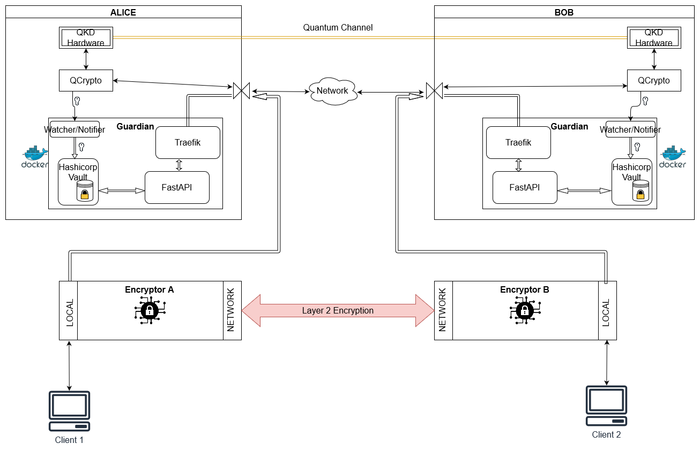

Description
===========

Here we describe the main idea behind Guardian and how implementation works.

.. figure is hosted on https://drive.google.com/file/d/1VQGuoq7LZ43WPWwCXOZMfQRjDovMVs17/view?usp=sharing

   The possible layout of the Guardian REST API is shown. Guardian receives quantum keys from QCrypto stack which communicates directly with the QKD hardware. Locally, within their secure sites, Encryptors A and B, with their proper TLS authentication methods, request keys for setting up a Layer 2 Encryption channel between themselves. Clients 1 and 2 can communicate through this encryption channel. They can also request their own keys from Guardian if they have the their personal TLS certificates recognised by Guardian.
   
   
Vault
-----

Vault_ is at the core of Guardian which keeps the secret data and also controls access to tokens and certificates.
In our implementation, the Vault contains two engines,

#. Public Key Infrastructure engine (PKI engine) for controlling access through TLS authentication.
#. Key Value engine (KV engine) for securing the Quantum distributed secret keys.

Setting up Vault is intended to be a manual process as a secured system should be configured carefully to ensure that everything is safe.

   #. Vault server is started with configurations stored in the vault-config.hcl file. This server will accept TLS connection from a key-certificate pair that was defined in startup (vault_init....) :ref:`Some description here <vault_startup1>`
   
   #. Authenticate through TLS as vault_init. Initialize through Python hvac_ client.
      This will create a vault instance that generates Shamir secrets shares and an initial root token.
      
   #. Enable auditing, TLS certificates authentication and PKI secrets engine which can issue TLS certificates.
   
   #. With the PKI secrets engine, an intermediate CA is established, signed by the a chain leading to the Root CA.
   
   #. An Access Control List (ACL) policy is set up to determine services and clients access to the system. 
   
   #. Set up a the KV secrets engine for storing QKD key information.
   
   #. The default services (entities) that can access vault through the ACL are *watcher* and *rest*. For certificate signing, an additional entity with a suitable authentication method and appropriate policies can be added.
   
After setting up, the root token should be necessarily be revoked. The Shamir secret keys should also be distributed such that no one entity can unseal the vault or generate a new root token without the threshold number of unseal keys. 

.. note:: By design Vault starts up in a sealed state and needs to be unsealed with a minimum threshold of Shamir secret keys before it can be accessed. This is to protect from an offline physical attack.

The secrets in vault are then only accessed via ``rest`` and ``watcher`` services through Python ``hvac``

.. _Vault: https://www.vaultproject.io/

.. _hvac: https://pypi.org/project/hvac/

Watcher
-------

Watcher is a Python script that looks at the notifier pipe established by the QCrypto stack. Everytime a final key pair is available, watcher will ingest the key into Vault.

FastAPI
-------

Guardian is built upon FastAPI_. It handles the requests from the SAEs and also the requests and responses for the other KMEs internally through Python scripts. It is **not** responsible for authenticating the SAEs but merely processes the requests and does the management that is necessary for generating symmetric keys based on the local QKD keys in Vault.

The general steps that each request will go through are

#. Determine the local sae_id from the presented certificate common name 
#. (Check local client list to determine if authorised? [1]_ )
#. Determine the remote sae_id from request
#. Establish the remote kme address paired to the remote sae_id [1]_
#. Connect to vault to access correct secrets, ledger and generate appropriate queries.
#. Establish requests to remote kme is necessary and get response.
#. Respond to local sae.

.. _FastAPI: https://fastapi.tiangolo.com/

.. [1] Not implemented yet as of version 0.7

Traefik
-------

Traefik_ is a proxy service that routes the incoming traffic to the correct processes that will handle them. In Guardian, traefik is mainly responsible for ensuring TLS authentication from the client. This is done by holding the key-certificate pair that identifies it as the server in the TLS connection.
   
Since traefik is the one handling TLS Authentication it is also possible to add custom CA chains into the configuration to allow other trusted parties to interact with Guardian without them issuing a Certificate Signing Request.

.._Traefik: https://doc.traefik.io/traefik/