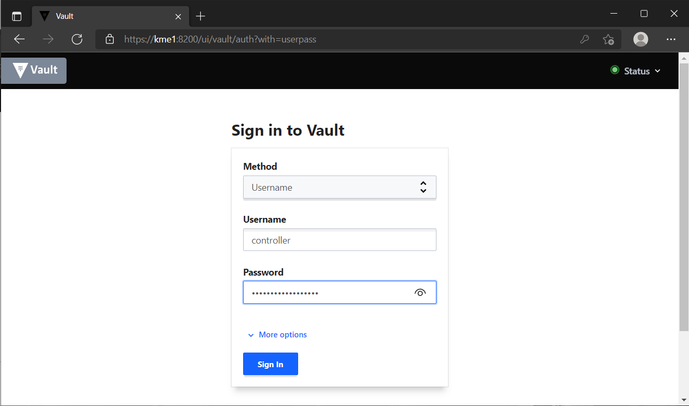

.. _cert_tree:

Certificates
============

The certificate chain of Guardian is::
   
   S15 Root CA
   |
   +--S15 QKD intermediate CA
      |
      +--KME operator intermediate CA (kme)
         |
         +--Internal Intermediate CA (generated by ``cert_auth``)
         |  |
         |  +-- Vault server certificate
         |  +-- Vault client certificate (``vault_init``)
         |
         +--Vault PKI engine Intermediate CA 
            |
            +-- Service client certificates, ``rest``, ``watcher``
            +-- SAE client certificates
 

In order to verify an identity through TLS mutual authentication, both server and client present their certificates with or without their CA chain. They will then verify the others certificates with their trusted CA chains to determine the authenticity of the certificates before deciding to continue with the connection.

Additional Clients
------------------

To add additional individual SAE clients, the KME will need to verify the authenticity of the SAEs. One way to do this is for the SAE to present a Certificate Signing Request to be signed by the Vault PKI engine Intermediate CA. The mandatory identifier needed by Guardian is the 

   #. Common Name

Recommended identifiers are 
   
   2. Country
   
   #. State

   #. Locality
   
   #. Organisation Unit
   
   
.. tip::

   As of 2021, a minimum key length of 2048-bit RSA or 256-bit ECC for client certificate signing is **strongly recommended**.

----

Certificate Signing
-------------------

Once the client presents his/her CSR, the |QKDdc| can sign it and issue a certificate together with the chain for the client to use. 

.. warning::

   Signing a CSR and issuing a certificate implies that the client will be able authenticate using his key and certificate chain to any server that trusts the same CA chain. As such always verify the identity of the client making the CSR before signing it.
   
We show examples of signing the CSR through Vault GUI via a web browser, Vault API https requests and Python ``hvac``.'

In this example, we created an entity named *controller* that can authenticate via username/password, TLS certificate and/or tokens. *controller* has access to the PKI engine secrets enabled at the ``/pki_int`` path in Vault. 

GUI
^^^

This example uses the Vault GUI via a TLS enabled Web browser. A certificate that can authenticate to the Vault UI at port 8200 needs to be already installed. 
Navigate to the Vault UI page which is ``https://kme1:8200/ui/vault/auth`` in this example. Since we are authenticating via username/password in this GUI example, select Username under Method and insert username and password.

   The controller is authorized to log in to Vault UI via username and password

   
   Once logged in, the controller can see the ``/pki_int`` secrets engine. He/She however cannot access the KV secrets that holds the QKDkeys.  
   
.. figure:: ./images/vault_cert_roles.png
   :alt: Intermediate CA role

   Inside the /pki_int engine, the ``role_int_ca_cert_issuer`` role is enabled and the |QKDdc| can generate and/or sign certificates. 
   

   
   Copy the CSR from the client into the textbox. It is **not recommended** to sign verbatim unless the client is highly trusted. Set a unique common name for the client to overwrite the default in the CSR. DNS/Email and IP SANs may also be set. Other SANs will need a valid `Object identifier <https://en.wikipedia.org/wiki/Object_identifier>`_ to be able to be assigned. Also the role needs to be set up to allow the other SANs.

   
   Once signed, the certificate can be given back to the client together with the Chain and he/she can now use the cert and key together to authenticate to Guardian.

.. Vault CLI      # Vault CLI on the Web browser UI is limited. Vault CLI on the shell needs access to Docker which is executed with root privileges and should not be handed out easily. So we skip this example.
   ^^^^^^^^^

   https://www.vaultproject.io/docs/secrets/pki#usage

Vault API
^^^^^^^^^

In this example we show how to sign the CSR with Vault `API`_. To use this method, a Token is required. First we obtain the token_ using the controller TLS certificate and the ``/auth/cert/login`` backend. 

.. tabs::

   .. group-tab:: Sample Payload

      .. code:: json
        
         {
            "name": "controller_cert"
         }

    
   .. group-tab:: Sample Request

      .. code:: shell-session
        
         $ curl \
             --request POST \
             --data @payload.json \
             --key key.pem \
             --cert cert.pem \
             --cacert cacert.pem \
             http://kme_id:8200/v1/auth/cert/login
  
   .. group-tab:: Sample Request 2

      .. code:: shell-session
        
         $ curl \
             --request POST \
             --data '{"name":"controller_cert"}' \
             --key key.pem \
             --cert cert.pem \
             --cacert cacert.pem \
             http://kme_id:8200/v1/auth/cert/login

   .. group-tab:: Sample Response

      .. code:: json
        
         {
            "request_id": "1b7875eb-ffc3-600f-f113-7426a33deb14",
            "lease_id": "",
            "renewable": false,
            "lease_duration": 0,
            "data": null,
            "wrap_info": null,
            "warnings": null,
            "auth": {
             "client_token": "s.oH84kH51TwdW0zFqBtCAvfV8",
             "accessor": "1kMYfFlUYRxv6GhXU2tTbIOh",
             "policies": [
               "controller",
               "default"
             ],
             "token_policies": [
               "controller",
               "default"
             ],
             "metadata": {
               "authority_key_id": "e3:2c:a1:91:89:1f:11:a5:b9:86:c9:bd:49:59:f2:83:34:e7:41:0d",
               "cert_name": "controller_cert",
               "common_name": "controller",
               "serial_number": "97808637626550026007576656242691520882507143102",
               "subject_key_id": "cb:7c:ce:fa:f6:5a:d3:04:5a:e6:7c:11:44:f8:44:3d:cd:3c:a4:9c"
             },
             "lease_duration": 3600,
             "renewable": true,
             "entity_id": "693e5d3a-880c-17f5-65ba-eadf5b0c51c8",
             "token_type": "service",
             "orphan": true
            }
         }

   
where ``controller_cert`` is the ``cert_name`` that is defined in the cert authentication method.

Using the Client token we now send the following POST request

.. tabs::

   .. group-tab:: Sample Payload

      .. code:: json
        
         {
            "csr": "-----BEGIN CERTIFICATE REQUEST-----\nMIIBPTCBxAIBADBFMQswCQYDVQQGEwJBVTETMBEGA1UECAwKU29tZS1TdGF0ZTEh\nMB8GA1UECgwYSW50ZXJuZXQgV2lkZ2l0cyBQdHkgTHRkMHYwEAYHKoZIzj0CAQYF\nK4EEACIDYgAEZQ923Hm0z1/EV6jmlRsFgCbUQTFxY8jOUXlGK0aBXiNNZsv2vBap\n/amG5KrBIN/H5BDDMULmw9ANOGDXr+DJcjXoA/lymZIxjEp3ufJrVeaTvZpnBrtg\nigf/sAliuKjkoAAwCgYIKoZIzj0EAwIDaAAwZQIxAP/dUltIUEJ4qlUyX9jfPOcx\n7fzegJ4thWdnwu4hCTx64htl5tsYVM04+W5FvHeQhgIwRyXPJi87masJT9qqbBpb\nlsFAv7Wp2YwJRJXQAl5fV2nBEHvQgR2MBnyTBFIFDh5q\n-----END CERTIFICATE REQUEST-----",
            "common_name": "unique_sae_id"
         }
   
   .. group-tab:: Sample Request

      .. code:: shell-session
        
         $ curl \
            --header "X-Vault-Token: s.oH84kH51TwdW0zFqBtCAvfV8"
            --request POST \
            --data @payload.json \
            --key key.pem \
            --cert cert.pem \
            --cacert cacert.pem \
            http://kme_id:8200/v1/pki_int/sign/role_int_ca_cert_issuer
  
   Where the Token is the one obtain in the previous request.
   
   .. group-tab:: Sample Response

      .. code:: json
        
         {
           "request_id": "a3134f0a-b36e-97ef-3010-f22b76765a2c",
           "lease_id": "pki_int/sign/role_int_ca_cert_issuer/6mZA9L2qt2qHXJ1xcEqVPCYW",
           "renewable": false,
           "lease_duration": 31535999,
           "data": {
             "ca_chain": [
               "-----BEGIN CERTIFICATE-----\nMIIDAzCCAoqgAwIBAgICEAEwCgYIKoZIzj0EAwIwgdgxCzAJBgNVBAYTAlVTMQ4w\nDAYDVQQIEwVUZXhhczEPMA0GA1UEBxMGQXVzdGluMSowKAYDVQQKEyFRdWFudHVt\nIEludGVybmV0IFRlY2hub2xvZ2llcyBMTEMxITAfBgNVBAsTGFF1YW50dW0gSGFj\na2luZyBEaXZpc2lvbjE3MDUGA1UEAxMuUXVhbnR1bSBJbnRlcm5ldCBUZWNobm9s\nb2dpZXMgTExDIFJvb3QgQ0Ega21lMTEgMB4GCSqGSIb3DQEJARYRYWRtaW5AZXhh\nbXBsZS5jb20wHhcNMjExMjA3MDM0MTE4WhcNMzExMjA1MDM0MTE4WjCBlzELMAkG\nA1UEBhMCVVMxDjAMBgNVBAgTBVRleGFzMSowKAYDVQQKEyFRdWFudHVtIEludGVy\nbmV0IFRlY2hub2xvZ2llcyBMTEMxGDAWBgNVBAsTD1F1YW50dW0gSGFja2luZzEy\nMDAGA1UEAwwpVmF1bHQgSW50ZXJtZWRpYXRlIENBIHBraV9pbnQgbW91bnQgcG9p\nbnQwdjAQBgcqhkjOPQIBBgUrgQQAIgNiAAQ+XfgJqpu1GBS1rDH4hBebVFxF906e\nz1aX0rPWXQKKlEE4oAmxquF1vzxyAt1hWHBGW7R0Szi8f3q3diGqxgLYvugxV32J\nFcWDiYssMV9Imts/NWeHyEzCYD7IUQ7AYoGjZjBkMB0GA1UdDgQWBBTjLKGRiR8R\npbmGyb1JWfKDNOdBDTAfBgNVHSMEGDAWgBS+qdSAQmt9K65MUB8JkMlhNZ4m+zAS\nBgNVHRMBAf8ECDAGAQH/AgEAMA4GA1UdDwEB/wQEAwIBhjAKBggqhkjOPQQDAgNn\nADBkAjALrWEuzsl6Xsryy+xYfSebQVjFSP+WpnNKb6blgRnrseVAbpxoung0xqYp\nR0fAWxYCMHC9sE2N5geOOsOP4BMpfsC4vIt/FRk2Cr7tf4RfJDE46eS9LwrfUj6Z\n93NEQSAEvw==\n-----END CERTIFICATE-----",
               "-----BEGIN CERTIFICATE-----\nMIIDVDCCAtqgAwIBAgIUQ8vZFuFPa5NTX5pE80GsIAELZpAwCgYIKoZIzj0EAwIw\ngdgxCzAJBgNVBAYTAlVTMQ4wDAYDVQQIEwVUZXhhczEPMA0GA1UEBxMGQXVzdGlu\nMSowKAYDVQQKEyFRdWFudHVtIEludGVybmV0IFRlY2hub2xvZ2llcyBMTEMxITAf\nBgNVBAsTGFF1YW50dW0gSGFja2luZyBEaXZpc2lvbjE3MDUGA1UEAxMuUXVhbnR1\nbSBJbnRlcm5ldCBUZWNobm9sb2dpZXMgTExDIFJvb3QgQ0Ega21lMTEgMB4GCSqG\nSIb3DQEJARYRYWRtaW5AZXhhbXBsZS5jb20wHhcNMjExMjA3MDM0MTAwWhcNNDEx\nMjAyMDM0MTAwWjCB2DELMAkGA1UEBhMCVVMxDjAMBgNVBAgTBVRleGFzMQ8wDQYD\nVQQHEwZBdXN0aW4xKjAoBgNVBAoTIVF1YW50dW0gSW50ZXJuZXQgVGVjaG5vbG9n\naWVzIExMQzEhMB8GA1UECxMYUXVhbnR1bSBIYWNraW5nIERpdmlzaW9uMTcwNQYD\nVQQDEy5RdWFudHVtIEludGVybmV0IFRlY2hub2xvZ2llcyBMTEMgUm9vdCBDQSBr\nbWUxMSAwHgYJKoZIhvcNAQkBFhFhZG1pbkBleGFtcGxlLmNvbTB2MBAGByqGSM49\nAgEGBSuBBAAiA2IABBDrYNxiJPdozJL1M4PXNaxhIPaYRmBvr1LVm+pcHni7pqs6\nc5hIghTImy8w/Okws8zgSoeQ9Sr/0g0TncxGAlDAQ0Xk2j04XaUJp77fUIw4mRp/\n1Bc+96Y/g/J6C+o+PKNjMGEwHQYDVR0OBBYEFL6p1IBCa30rrkxQHwmQyWE1nib7\nMB8GA1UdIwQYMBaAFL6p1IBCa30rrkxQHwmQyWE1nib7MA8GA1UdEwEB/wQFMAMB\nAf8wDgYDVR0PAQH/BAQDAgGGMAoGCCqGSM49BAMCA2gAMGUCMFnVNjvLaoIGX81M\nDQDwzqurpc9AgLDSlo2UxHjHvRaapuk/apEuYt5G7dpjy306sgIxAJxt+JrMaFwB\nZvPCDPl4k+dnyvinY5mxGao98yvNqSSlht6rdmHRSuGKqqdRaYC6vA==\n-----END CERTIFICATE-----"
             ],
             "certificate": "-----BEGIN CERTIFICATE-----\nMIIDSTCCAs+gAwIBAgIUSqI3AJ+VrTdB0Kn8tTRQGwuGo4AwCgYIKoZIzj0EAwIw\ngZcxCzAJBgNVBAYTAlVTMQ4wDAYDVQQIEwVUZXhhczEqMCgGA1UEChMhUXVhbnR1\nbSBJbnRlcm5ldCBUZWNobm9sb2dpZXMgTExDMRgwFgYDVQQLEw9RdWFudHVtIEhh\nY2tpbmcxMjAwBgNVBAMMKVZhdWx0IEludGVybWVkaWF0ZSBDQSBwa2lfaW50IG1v\ndW50IHBvaW50MB4XDTIxMTIyOTA2NTAxNloXDTIyMTIyOTA2NTA0NlowgYwxCzAJ\nBgNVBAYTAlVTMQ4wDAYDVQQIEwVUZXhhczEPMA0GA1UEBxMGQXVzdGluMSowKAYD\nVQQKEyFRdWFudHVtIEludGVybmV0IFRlY2hub2xvZ2llcyBMTEMxGDAWBgNVBAsT\nD1F1YW50dW0gSGFja2luZzEWMBQGA1UEAwwNdW5pcXVlX3NhZV9pZDB2MBAGByqG\nSM49AgEGBSuBBAAiA2IABGUPdtx5tM9fxFeo5pUbBYAm1EExcWPIzlF5RitGgV4j\nTWbL9rwWqf2phuSqwSDfx+QQwzFC5sPQDThg16/gyXI16AP5cpmSMYxKd7nya1Xm\nk72aZwa7YIoH/7AJYrio5KOB5DCB4TAOBgNVHQ8BAf8EBAMCA6gwHQYDVR0lBBYw\nFAYIKwYBBQUHAwEGCCsGAQUFBwMCMB0GA1UdDgQWBBTLfM769lrTBFrmfBFE+EQ9\nzTyknDAfBgNVHSMEGDAWgBTjLKGRiR8RpbmGyb1JWfKDNOdBDTA8BggrBgEFBQcB\nAQQwMC4wLAYIKwYBBQUHMAKGIGh0dHBzOi8vdmF1bHQ6ODIwMC92MS9wa2lfaW50\nL2NhMDIGA1UdHwQrMCkwJ6AloCOGIWh0dHBzOi8vdmF1bHQ6ODIwMC92MS9wa2lf\naW50L2NybDAKBggqhkjOPQQDAgNoADBlAjEAs4sho46CJTqlnKnwcEwAi4KfwRaT\nmCmmGWeAUgaBKG0qg648YJdNC3fiVRmp3mAjAjB25jHlyY34lj26suq7+/8peMXt\nje6+4LEDJ1XbMAXe7OnJ2PyXMzivuHQLbpHJtYU=\n-----END CERTIFICATE-----",
             "expiration": 1672296646,
             "issuing_ca": "-----BEGIN CERTIFICATE-----\nMIIDAzCCAoqgAwIBAgICEAEwCgYIKoZIzj0EAwIwgdgxCzAJBgNVBAYTAlVTMQ4w\nDAYDVQQIEwVUZXhhczEPMA0GA1UEBxMGQXVzdGluMSowKAYDVQQKEyFRdWFudHVt\nIEludGVybmV0IFRlY2hub2xvZ2llcyBMTEMxITAfBgNVBAsTGFF1YW50dW0gSGFj\na2luZyBEaXZpc2lvbjE3MDUGA1UEAxMuUXVhbnR1bSBJbnRlcm5ldCBUZWNobm9s\nb2dpZXMgTExDIFJvb3QgQ0Ega21lMTEgMB4GCSqGSIb3DQEJARYRYWRtaW5AZXhh\nbXBsZS5jb20wHhcNMjExMjA3MDM0MTE4WhcNMzExMjA1MDM0MTE4WjCBlzELMAkG\nA1UEBhMCVVMxDjAMBgNVBAgTBVRleGFzMSowKAYDVQQKEyFRdWFudHVtIEludGVy\nbmV0IFRlY2hub2xvZ2llcyBMTEMxGDAWBgNVBAsTD1F1YW50dW0gSGFja2luZzEy\nMDAGA1UEAwwpVmF1bHQgSW50ZXJtZWRpYXRlIENBIHBraV9pbnQgbW91bnQgcG9p\nbnQwdjAQBgcqhkjOPQIBBgUrgQQAIgNiAAQ+XfgJqpu1GBS1rDH4hBebVFxF906e\nz1aX0rPWXQKKlEE4oAmxquF1vzxyAt1hWHBGW7R0Szi8f3q3diGqxgLYvugxV32J\nFcWDiYssMV9Imts/NWeHyEzCYD7IUQ7AYoGjZjBkMB0GA1UdDgQWBBTjLKGRiR8R\npbmGyb1JWfKDNOdBDTAfBgNVHSMEGDAWgBS+qdSAQmt9K65MUB8JkMlhNZ4m+zAS\nBgNVHRMBAf8ECDAGAQH/AgEAMA4GA1UdDwEB/wQEAwIBhjAKBggqhkjOPQQDAgNn\nADBkAjALrWEuzsl6Xsryy+xYfSebQVjFSP+WpnNKb6blgRnrseVAbpxoung0xqYp\nR0fAWxYCMHC9sE2N5geOOsOP4BMpfsC4vIt/FRk2Cr7tf4RfJDE46eS9LwrfUj6Z\n93NEQSAEvw==\n-----END CERTIFICATE-----",
             "serial_number": "4a:a2:37:00:9f:95:ad:37:41:d0:a9:fc:b5:34:50:1b:0b:86:a3:80"
           },
           "wrap_info": null,
           "warnings": null,
           "auth": null
         }

Note that the new lines needs to be formatted as \\n in JSON.

.. _token : https://www.vaultproject.io/api-docs/auth/cert#login-with-tls-certificate-method

.. _API: https://www.vaultproject.io/api-docs/secret/pki#sign-certificate

----

HVAC
^^^^

Finally using the ``hvac`` client, we can similarly `Sign a Certificate <https://hvac.readthedocs.io/en/stable/usage/secrets_engines/pki.html#sign-certificate>`_ with the following python command with the necessary credentials.

.. code-block:: python
   :linenos:
   
	import hvac
	client = hvac.Client(
            url="https://kme1:8200/",
            cert=("cert.pem","key.pem"),
            verify="cacert.pem")
   
   client.auth_tls()
   sign_certificate_response =   client.secrets.pki.sign_certificate(
                                 mount_point='pki_int',
                                 name='role_int_ca_cert_issuer',
                                 csr='-----BEGIN CERTIFICATE REQUEST-----\nMIIBPTCBxAIBADBFMQswCQYDVQQGEwJBVTETMBEGA1UECAwKU29tZS1TdGF0ZTEh\nMB8GA1UECgwYSW50ZXJuZXQgV2lkZ2l0cyBQdHkgTHRkMHYwEAYHKoZIzj0CAQYF\nK4EEACIDYgAEZQ923Hm0z1/EV6jmlRsFgCbUQTFxY8jOUXlGK0aBXiNNZsv2vBap\n/amG5KrBIN/H5BDDMULmw9ANOGDXr+DJcjXoA/lymZIxjEp3ufJrVeaTvZpnBrtg\nigf/sAliuKjkoAAwCgYIKoZIzj0EAwIDaAAwZQIxAP/dUltIUEJ4qlUyX9jfPOcx\n7fzegJ4thWdnwu4hCTx64htl5tsYVM04+W5FvHeQhgIwRyXPJi87masJT9qqbBpb\nlsFAv7Wp2YwJRJXQAl5fV2nBEHvQgR2MBnyTBFIFDh5q\n-----END CERTIFICATE REQUEST-----',
                                 common_name='unique_sae_id')
   print('Signed certificate: {}'.format(sign_certificate_response))

The response will be the same as the response in `Vault API`_

----

.. |QKDdc| replace:: QKD device controller