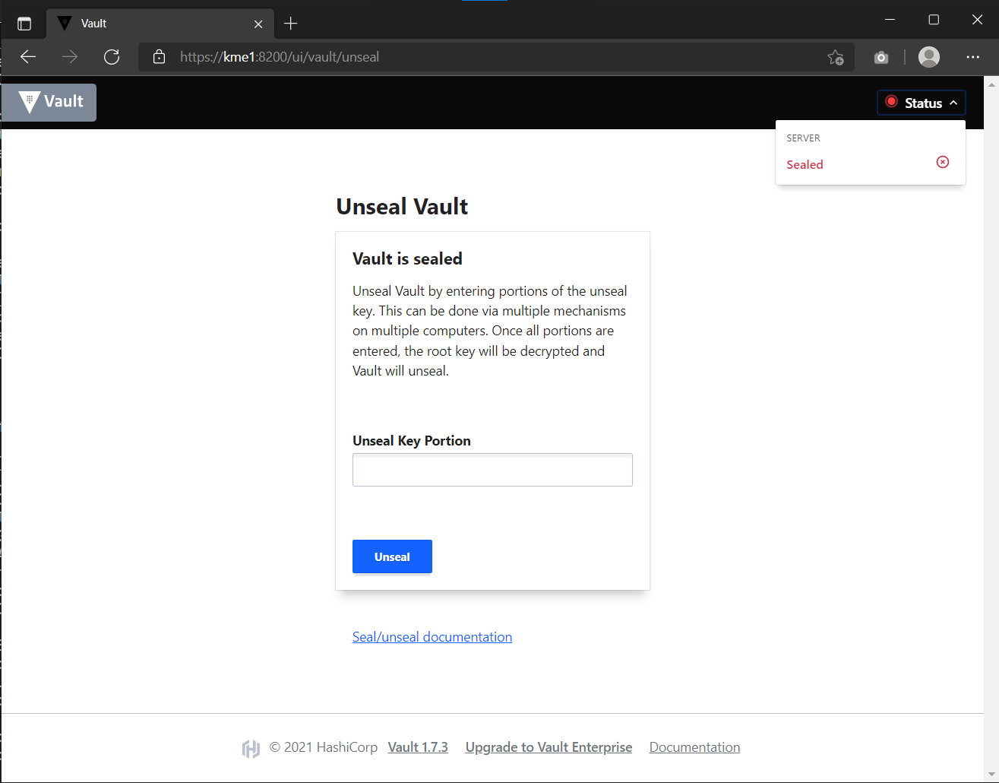
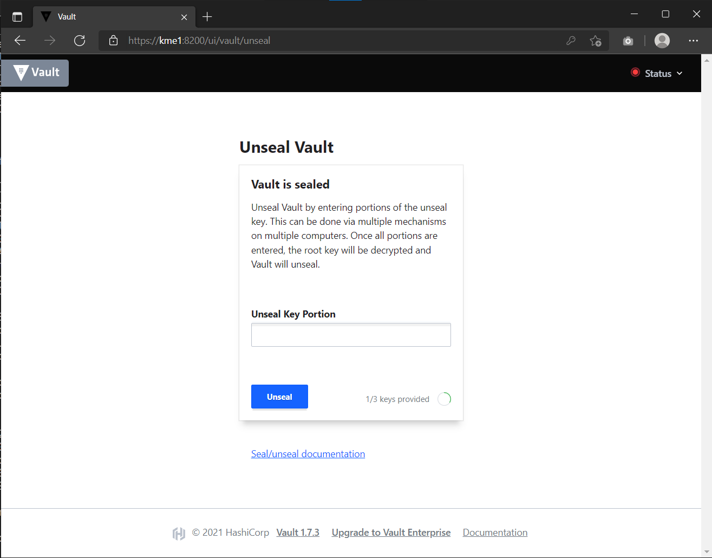
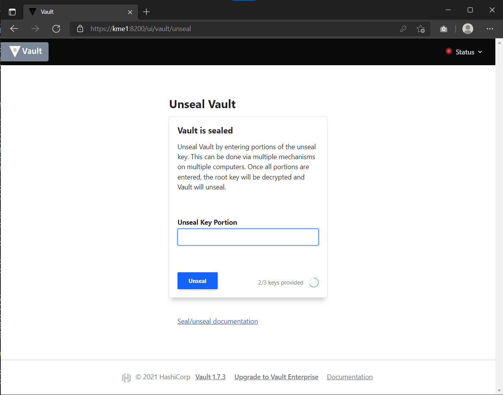
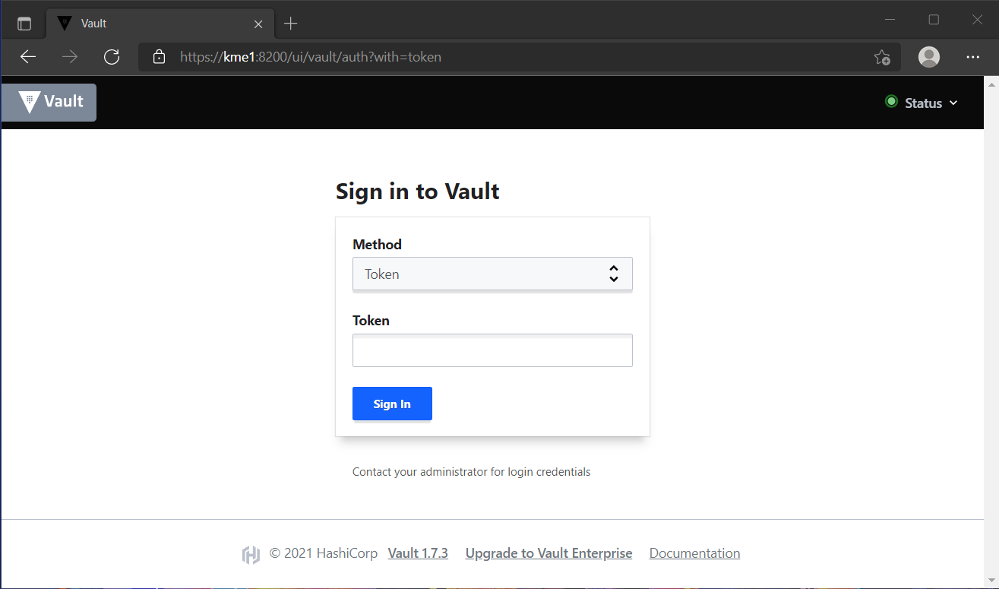
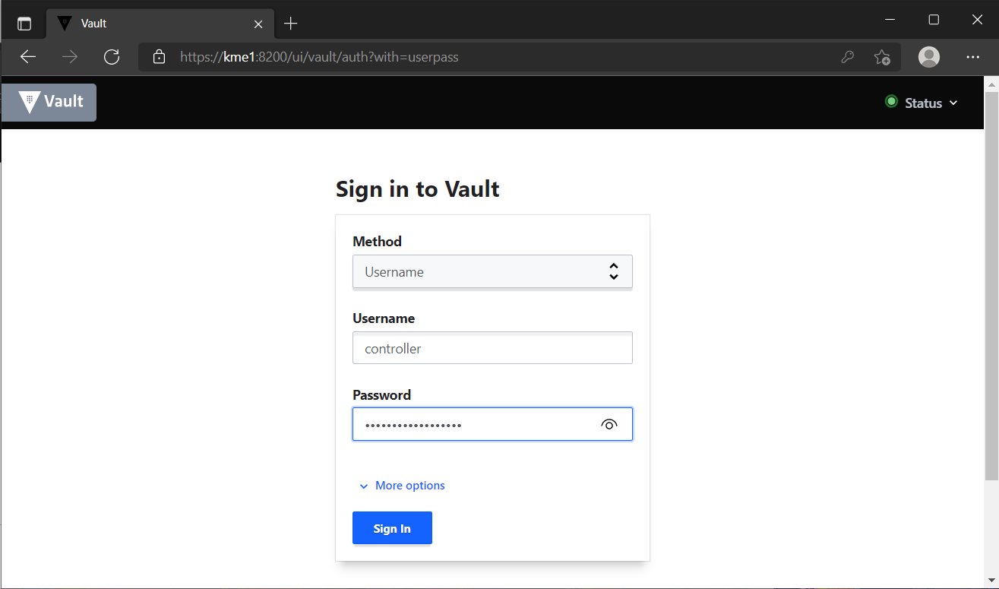
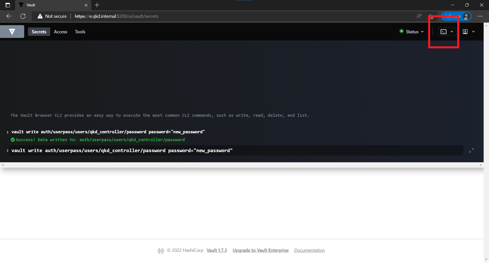

Controller Overview
===================

.. _`QKD_Controller`:

The |QKDdc| has a dual role in establishing QKD links between KMEs and also authorising SAEs onto which KME they can communicate to. In the initial implementation, only two nodes are present and thus the |QKDdc| is only responsible for stopping and starting the devices which is described in `QKDServer <https://github.com/s-fifteen-instruments/QKDServer/>`_. 

The |QKDdc| may also be responsible for unsealing the vault depending on how strict the implementation of the QKD device is configured. In the current [#]_ Guardian implementation, there is an ``unsealer`` process that does this automatically.

.. |QKDdc| replace:: QKD device controller

.. [#] Version |version|

.. _`unsealing vault`:

Unsealing Vault
---------------

Whenever the Vault is started, it is in a sealed state. It will also be the |QKDdc|'s duty together to unseal the vault (if implemented as such). He/she will need a minimum quorum of unseal keys in order to do this.

GUI
^^^

The unseal method using the Vault web UI is shown as an example below.

   
   When Vault is in a sealed state, the Vault GUI interface will indicate with a red sealed under status. It will display the following prompt for the Unseal Key Portion to be entered.

   
   If one unseal key is entered, it shows 1/3 keys provided.
   

   
   Similarly for two unseal keys entered.

   
   Once the vault is unsealed, the login screen is shown once again with the status now green indicating that Vault is unsealed.

----

API
^^^

Vault also has an API endpoint for the unsealing process. This is documented in `Vault documentation <https://www.vaultproject.io/api-docs/system/unseal>`_.
Briefly, it supplies a PUT request to `/sys/unseal` with a JSON payload of the unseal key.

.. tabs::

   .. group-tab:: Sample Payload

      .. code:: json
        
         {
            "key": "abcd1234..."
         }

    
   .. group-tab:: Sample Request

      .. code:: shell-session
        
         $ curl \
             --request PUT \
             --data @payload.json \
             --key key.pem \
             --cert cert.pem \
             --cacert cacert.pem \
             http://kme_id:8200/v1/sys/unseal

----

HVAC
^^^^

If using Python, the ``hvac`` module has the `submit_unseal_key(key=None, reset=False, migrate=False) <https://hvac.readthedocs.io/en/stable/usage/system_backend/seal.html?highlight=unseal#submit-unseal-key>`_ function. This is the same function that Guardian's ``unsealer`` uses.

In essence, this function makes use of the Vault API ``/v1/sys/unseal`` backend to input the unseal keys.

----

Changing Password
-----------------

The qkd_controller can login to the Vault via the userpass auth method that is enabled. This is for convenience in demonstration and initial setup and should be switched off in a production environment. The default password should be changed for security and can be done through the web UI, hvac or vault-API

web UI
^^^^^^

Log in the the vault web UI using the username and password

Once logged in, bring up the Vault browser CLI by clicking the shell icon at the top right hand corner. Enter ``vault write auth/userpass/users/qkd_controller/password password="new_password"`` where ``new_password`` is the updated new password.

Once successful, the password is changed and the new password can be used to log in.

HVAC
^^^^
.. code-block:: python
   :linenos:

   import hvac
   
   url = "https://kme_address:8200/"
   client_key = 'path/to/key"
   client_cert = 'path/to/cert"
   server_cert = 'path/to/server/cert'
   username = 'qkd_controller'
   password = 'qkd_controleer_password'
   
   vclient = hvac.Client(url,  cert = (client_cert, client_key), verify = server_cert)
   vclient.auth.userpass.login(username=username, password=password)
   new_password = 'new_qkd_controller_password'
   vclient.auth.userpass.update_password_on_user(username=username, password=new_password)

Vault will return a 204 empty respose if call is successful.

Vault API
^^^^^^^^^

In this example of changing the password with the Vault API. Similar to :ref:`CSR signing <vault_api>`, to use this method, a Token is required. First we obtain the token using the controller username and password and the ``/auth/userpass/users/login`` backend. 

.. tabs::

   .. group-tab:: Sample Payload

      .. code:: json
        
         {
            "password": "old_password"
         }

    
   .. group-tab:: Sample Request

      .. code:: shell-session
        
         $ curl \
               --request POST \
               --data @payload.json \
               --key key.pem \
               --cert cert.pem \
               --cacert cacert.pem \
               http://kme_id:8200/v1/auth/userpass/login/qkd_controller

  
   .. group-tab:: Sample Request 2

      .. code:: shell-session
        
         $ curl \
               --request POST \
               --data '{"password":"old_password"}' \
               --key key.pem \
               --cert cert.pem \
               --cacert cacert.pem \
               http://kme_id:8200/v1/auth/userpass/login/qkd_controller

   .. group-tab:: Sample Response

      .. code:: json
         
         {
            "request_id":"060eeb22-1de8-dce5-db38-bdc1b4252d5d",
            "lease_id":"",
            "renewable":false,
            "lease_duration":0,
            "data":null,
            "wrap_info":null,
            "warnings":null,
            "auth":
            {
               "client_token":"s.6A8w7llODw2gTxyBttVZBifz",
               "accessor":"WwmW7Nc162Mve2xIU3i53So2",
               "policies":["default","int_ca_cert_issuer"],
               "token_policies":["default"],
               "identity_policies":["int_ca_cert_issuer"],
               "metadata":{"username":"qkd_controller"},
               "lease_duration":3600,
               "renewable":true,
               "entity_id":"03d43c1b-71f7-a17e-9f43-54801d705caa",
               "token_type":"service",
               "orphan":true
            }
         }

With this token, the user password can be changed using the ``auth/userpass/users/{name}/password`` backend 

.. tabs::

   .. group-tab:: Sample Payload

      .. code:: json

         {
            "password": "new_password"
         }

   .. group-tab:: Sample Request

      .. code:: shell-session
     
         $ curl \
               --header "X-Vault-Token: s.6A8w7llODw2gTxyBttVZBifz"
               --request POST \
               --data @payload.json \
               --key key.pem \
               --cert cert.pem \
               --cacert cacert.pem \
               http://kme_id:8200/v1/auth/userpass/users/qkd_controller/password
          
----
