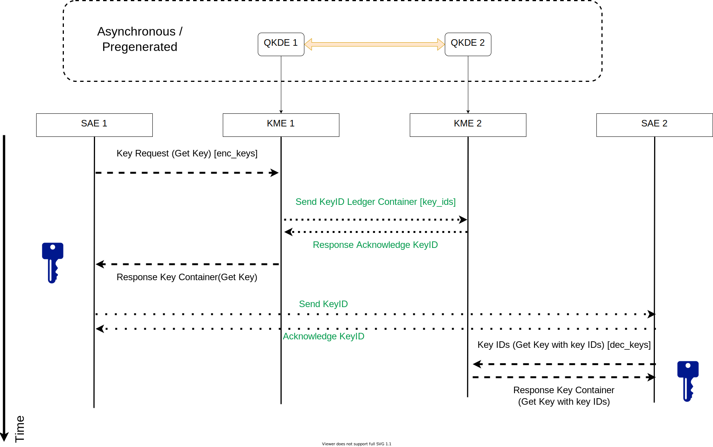

Overview
========

Guardian follows ETSI GS QKD 014 specification which aims to make it simple and easy for developers to understand. Its REST-based APIs uses data encoded in the JSON format to deliver block keys with key IDs to applications. This simplicity allows ease of implementation in a scalable way.

The goal of Guardian is to implement a simple request and response style API between an SAE (Secure Application Entity) and a KME (Key Management Entity). SAEs request keys from KMEs which then deliver them to the SAE.
SAEs are intended to have secure access to the KME they are connecting to. This API does not handle the secure key generation and distribution by the QKD technology - instead it accepts generated keys and secures the delivery of such keys to any SAE that makes a key request.

.. _prerequisites:

Prerequisites
-------------

Before using Guardian as an SAE, several prerequisites are needed.

   1. Programs to make GET/POST requests over HTTPS (minimally TLS 1.2) and decode JSON.
   2. A client-side key-certificate pair.

      - The certificate must already be recognized by the local KME - see :ref:`certificates`.

   3. The root certificate authority (CA) certificate, associated with the local KME, installed client-side.
   4. The corresponding SAE client ID(s) on other remotely connected KME(s).

Once setup, the SAE can make a connection to the local KME and make the API calls.
These calls can be found in :ref:`api`.
Communication between SAEs to agree on shared key IDs (for actual key retrieval from their respective KME) is user-defined and not within the scope of the API - see the sequence diagram in the next section.
 
Communication
-------------

The communication between the SAEs and the KMEs is shown in the figure below. The sequence of events occurs from top to bottom.

   In this diagram, SAE1 is the master SAE calling KME1 to request keys for communicating to Slave SAE2.
   