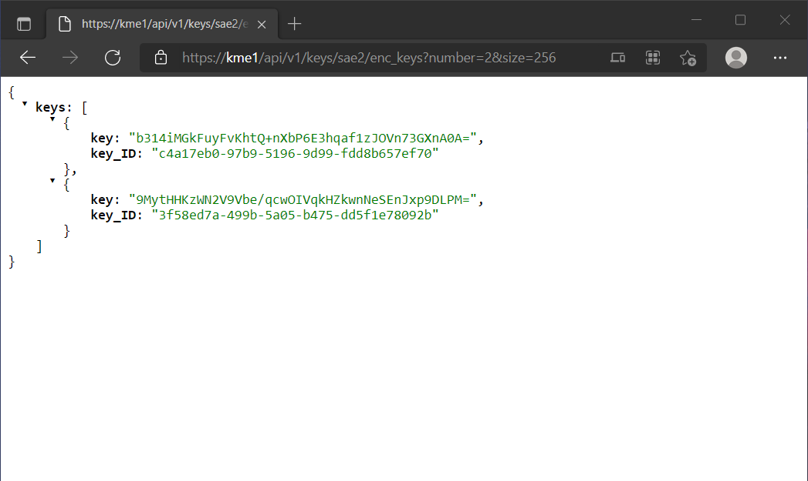
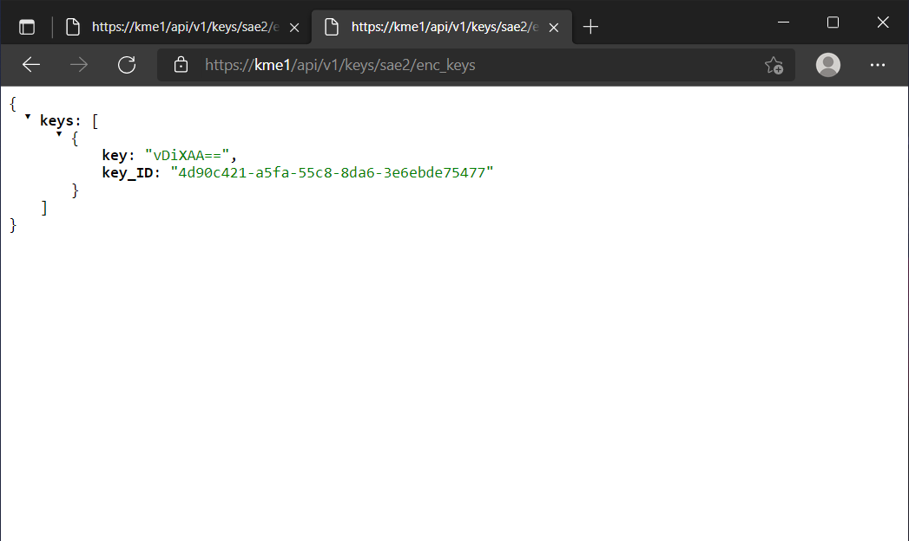
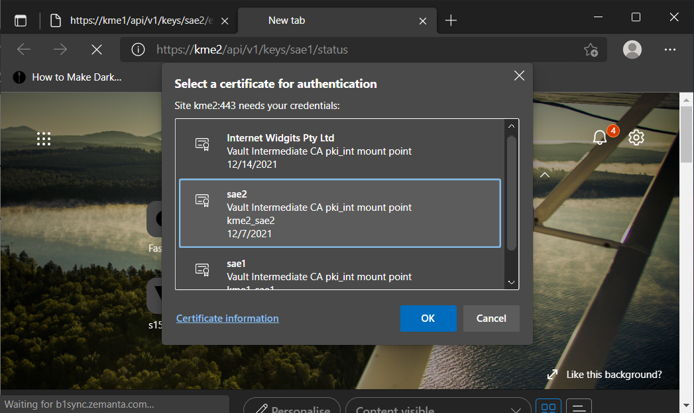
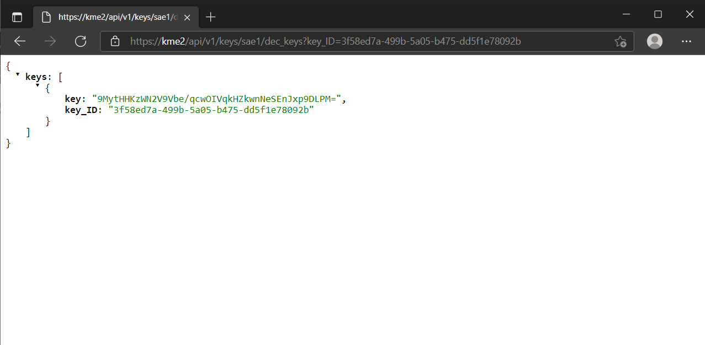
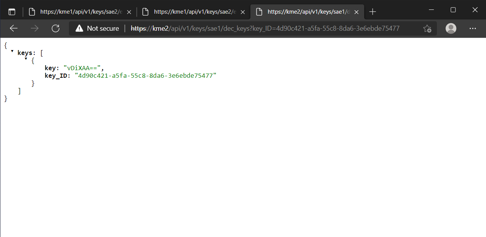
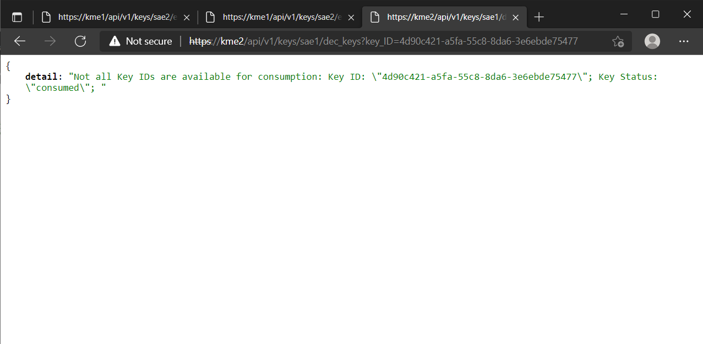

Usage
=====

Once the :ref:`requirements <prerequisites>` are in place, any modern web client, programming packages with TLS support, etc. can be used to access the APIs. We list examples using Chrome based Web browser, python Request library, cURL and openssl

We assume that the SAE key-certificate pair together with the root CA is already installed in the certificate manager used by the Web browser for the first example. 
In the other examples, the key-certificate pair is in a PEM format in the same directory as that the commands are executed in.
Also, the hostname kme1 and kme2 directs to the correct KMEs with sae1 and sae2 the clients that can authenticate respectively.

Web Browser
-----------

We type the URL, ``https://kme1/api/v1/keys/sae2/status`` to get the status of the connection between KME1 to the KME that handles SAE2 which is KME2 in this example. Before the connection continues, the correct certificate needs to be presented to the server for authentication.

.. figure:: ./images/chrome_choose_cert.png
   :alt: Choose certificate
   
   Chrome prompts which certificate to use to do mutual authentication.
   
   
   
.. figure:: ./images/chrome_status.png
   :alt: Status of connection to SAE2
   
   After authentication, we receive the response of the GET status method. The default key size is |default_size| bits and other limits are readable here.
   
To request two keys of length 256 bits to use in communicating to sae2, we use the Get Key method by send the URL, ``https://kme1/api/v1/keys/sae2/enc_keys?number=2&size=256``.

   
   Response from kme1 to sae1 with 2 keys of length 256 bits each.
   
The keys are returned in a key container formatted using JSON. The keys are encoded in base64 which pads the final character using ``=`` if the total number of bits is not a multiple of 6 (2^6 = 64). Together with the key is the corresponding key_ID that has to be notified to sae2 for him/her to retrive his/her key from kme2. If the options ``number`` and ``size`` are not defined, kme1 will return the default one key with |default_size| bits.

   
   Without any options, the kme1 returns one key the size of |default_size| bits. 
 
Now sae1 has 3 keys with their corresponding key_IDs. The key_IDs are communicated to sae2 which then calls the Get key with Key ID method.

   
   Chrome prompts which certificate to use to do mutual authentication for sae2 and kme2.
   
Now we identify as sae2 itself sae2 certificate to kme2. With the Get method we send the URL ``https://kme2/api/v1/keys/sae1/dec_keys?key_ID=3f58ec7a-499b-5a05-b475-dd5f1e78092b``. With the Get method we can only request one key at a time.

   
   sae2 retrives the key from KME2.

   
   sae2 retrives the another key from KME2. ``https://kme2/api/v1/keys/sae1/dec_keys?key_ID=4d90c421-a5fa-55c8-8da6-3e6ebde75477``   

Once the key is retrived, it is deleted from KME2 and a subsequent call is made, an error is reported that the key has been consumed.

   
   sae2 tries to retrives the same key again from KME2. ``https://kme2/api/v1/keys/sae1/dec_keys?key_ID=4d90c421-a5fa-55c8-8da6-3e6ebde75477``   

With this, sae1 and sae2 a set of QKD keys that they can use to communicate with each other.

.. |default_size| replace:: 32
   

