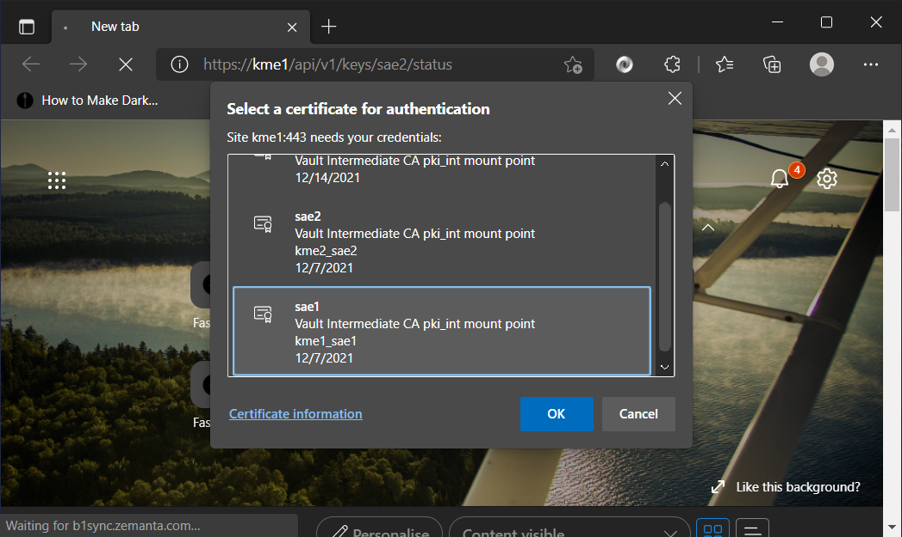
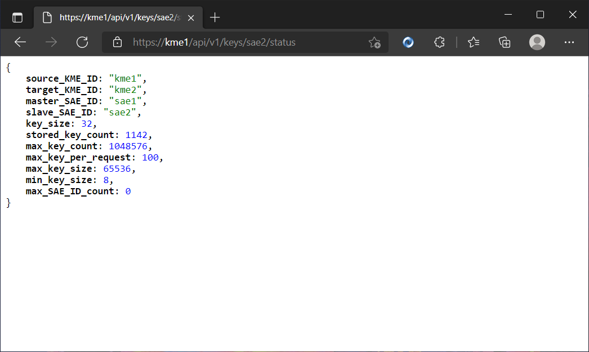

Usage
=====

Once the :ref:`requirements <prerequisites>` are in place, any modern web client, programming packages with TLS support, etc. can be used to access the APIs. We list examples using Chrome based Web browser, python Request library, cURL and openssl

We assume that the SAE key-certificate pair together with the root CA is already installed in the certificate manager used by the Web browser for the first example. 
In the other examples, the key-certificate pair is in a PEM format in the same directory as that the commands are executed in.
Also, the hostname kme1 and kme2 directs to the correct KMEs with sae1 and sae2 the clients that can authenticate respectively.

Web Browser
-----------

We type the URL, ``https://kme1/api/v1/keys/sae2/status`` to get the status of the connection between KME1 to the KME that handles SAE2 which is KME2 in this example. Before the connection continues, the correct certificate needs to be presented to the server for authentication.

   
   Chrome prompts which certificate to use to do mutual authentication.
   
   
   

   
   After authentication, we receive the response of the GET status method. The default key size is 32 bits and other limits are readable here.

