# Interacting with the REST API

* [Certificates](#certificates)
* [Makefile Comparsion Testing](#makefile-comparison-testing)
* [From a Web Browser](#from-a-web-browser)
* [REST API Documentation (OpenAPI)](#rest-api-documentation-openapi)
* [Using cURL](#using-curl)
* [Using OpenSSL's s_client](#using-openssl-and-sclient)

## Certificates

NOTE: This assumes that both KME hosts have their respective REST API services fully up and running.

Several certificate and private key pairs are generated on a per docker-compose service level. For each KME host, the directory `${TOP_DIR}volumes/${LOCAL_KME_ID}/certificates/production/` will contain all client- and server-based certificate pairs; e.g.:
```bash
bob@qtpi-2:~/code/guardian$ ls volumes/kme2/certificates/production/
admin  rest  sae2  vault  vault_init  watcher
```

Each directory will at least contain a Certificate Authority (CA) chain certificate PEM-encoded file as well as its corresponding private key PEM-encoded file; e.g.:
```bash
bob@qtpi-2:~/code/guardian$ tree volumes/kme2/certificates/production/sae2
volumes/kme2/certificates/production/sae2
├── sae2.ca-chain.cert.pem
└── sae2.key.pem
```

The CA-chain file contains the certificate as well as the certificates of the issuing CAs all the way back to the Root CA in descending order. In other words, the client/server certificate will be at the top of the file, then usually an intermediate CA's certificate, followed by a Root CA's certificate at the bottom:
```
# ca-chain.cert.pem file layout
-----BEGIN CERTIFICATE-----
MIIFxzCCA6+gAwIBAgIUT7Vd1a/CyUbdfjwdsJKqSP1jcjMwDQYJKoZIhvcNAQEL
...Client/Server Certificate
cTY59YJLBU1HHOElXCTZWd8xwQvgFY4NURA6MeQFSIRWKYMzjH9SvLN/Gw==
-----END CERTIFICATE-----
-----BEGIN CERTIFICATE-----
MIIGMTCCBBmgAwIBAgICEAEwDQYJKoZIhvcNAQELBQAwgbYxCzAJBgNVBAYTAlVT
...Intermediate CA Certificate
entO9Cw=
-----END CERTIFICATE-----
-----BEGIN CERTIFICATE-----
MIIGXzCCBEegAwIBAgIUKQ0uB8y/FZ2CgPr8ub0Xousu1CgwDQYJKoZIhvcNAQEL
...Root CA Certificate
Bf2e
-----END CERTIFICATE-----
```

A local KME server is configured to allow interaction with its remote KME counterpart. This is possible because the respective rest service CA-chain files have been `rsync`ed to the remote KME during startup. Additionally, each KME is configured to allow interaction with its respective local SAE. In the above example, `sae2` may interact with `kme2`. Similarly `sae1` may interact with `kme1`.

The `admin` directory contains copies of the certificate and private key files in a world-readable file mode. This is for convenience and is not necessary for production. Additionally, PKCS #12 (.p12) files that contain both the CA-chain and private key information have been generated to more easily interact with web browsers which tend to more readily handle this certificate file format; e.g.
```bash
bob@qtpi-2:~/code/guardian$ ls -l volumes/kme2/certificates/production/admin/sae2
total 20
-rw-r--r-- 1 root root 6671 Jun  8 03:45 sae2.ca-chain.cert.pem
-r--r--r-- 1 root root 1674 Jun  8 03:45 sae2.key.pem
-rw-r--r-- 1 root root 6600 Jun  8 03:45 sae2.p12
```

The above cert.pem and key.pem files are identical to the ones in the `production/sae2` directory besides file permissions.

NOTE: For developers, the primary certificate pairs to utilize are `sae1` and `sae2`. Also note that intermediate certificate authorities exist within each Vault instance that can generate new certificate/private key pairs as well as sign any Certificate Signing Requests (CSRs) generated by SAE hosts.

## Makefile Comparison Testing

### Prerequisites

Please ensure that the `jq` binary is available **on the host running 'make compare'** to conduct `make compare` tests. To install:
```bash
# Ubuntu
sudo apt-get install jq
# Fedora
sudo dnf install jq
# OpenSUSE
sudo zypper install jq
```
### Under the Hood

SAE host certificates are `rsync`ed to the local host's `/tmp/guardian_test` directory and several tests are conducted from the [${TOP_DIR}/scripts/compare.sh](../scripts/compare.sh) script.

The compare script in turn calls the [key_loop.sh](../scripts/key_loop.sh) script which takes the number of requested keys, the size of the requested keys in bits, and the number of sequential iterations to perform, and calls [key_compare.sh](../scripts/key_compare.sh) appropriately.

Various synchronous and asynchronous tests are conducted on small to modest size key requests.

NOTE: This test consumes keying material. If the KME runs out of keying material, this test will begin to fail in a seemingly sporadic fashion until all tests eventually fail. This is related to how keying material is reserved and consumed on the Vault back end and is to be expected.

NOTE: While unlikely, it is possible for Vault instances to become out of sync. This can lead to comparison failures. The most straightforward way to re-sync is to first `make clear` on both KME hosts to clear out the Vault instances. From there, issue more keys via `make keys` on the KME1 host and then subsequently on the KME2 host. Afterwards, `make compare` tests should be passing.

NOTE: Depending on many factors (number of outstanding requests, key sizes, epoch file size, computational power of the REST server, etc.) it is possible to overload the KME REST servers. In this event, status return codes will either be 503 or 504 as the local/remote KME hosts timeout attempting to return keying material. The servers should be able to recover without data loss/desynchronization once the load drops.

### Running

From the KME1 host or from a host that has passwordless SSH to both KME1 and KME2 hosts, it is possible to issue a `make compare` to utilize the `sae1` and `sae2` certificates; e.g.:
```bash
# A successful run
alice@qtpi-1:~/code/guardian$ make compare

Using Local KME configuration: 'kme1'
Use the command-line syntax, e.g. 'KME=kme2' to change

Remote KME Repository Location: 'bob@kme2:/home/bob/code/guardian'
Use the command-line syntax, e.g. 'REMOTE_KME_DIRPATH=alice@kme1:/home/alice/code/guardian' to change

Environment variables used throughout Guardian:
KME: kme1
LOCAL_KME_ID: kme1
REMOTE_KME_ID: kme2
LOCAL_SAE_ID: sae1
REMOTE_SAE_ID: sae2

./scripts/compare.sh
receiving incremental file list

sent 25 bytes  received 136 bytes  64.40 bytes/sec
total size is 14,945  speedup is 92.83
receiving incremental file list

sent 25 bytes  received 132 bytes  62.80 bytes/sec
total size is 14,949  speedup is 95.22
1 key; 8 bits each; 4 iterations
1: Key IDs match! Keys match! PASS
2: Key IDs match! Keys match! PASS
...
4 keys; 8 bits each; 4 iterations
...
1 key; 256 bits each; 4 iterations
...
4 keys; 256 bits each; 4 iterations
4 simultaneous requests; 1 key; 8 bits each; 4 iterations
1: 1: 1: 1: Key IDs match! Keys match! PASS
2: Key IDs match! Keys match! PASS
2: Key IDs match! Key IDs match! Keys match! Keys match! PASS
...
Key IDs match! Keys match! PASS
```

```bash
# A run where there is failure to connect to KME hosts
cproctor@spren:guardian>make compare
...
./scripts/compare.sh
[Receiver] io timeout after 4 seconds -- exiting
rsync error: timeout in data send/receive (code 30) at io.c(197) [Receiver=3.2.3]
[Receiver] io timeout after 4 seconds -- exiting
rsync error: timeout in data send/receive (code 30) at io.c(197) [Receiver=3.2.3]


WARNING: Certificates could not be properly rsynced from KME hosts. Continuing...


1 key; 8 bits each; 4 iterations
1: Local Status Code: 000 FAIL
2: Local Status Code: 000 FAIL
```

```bash
# A run where one or both of the KME hosts become too busy
...
Key IDs match! Keys match! PASS
Remote Status Code: 503 FAIL
Key IDs match! Keys match! PASS
...
```

One possible output from the REST server log associated from the 503 status:
```bash
...
rest_1      | [2021-06-16 18:34:25 +0000] [12] [INFO] 172.19.0.2:43834 - "POST /api/v1/keys/sae1/dec_keys HTTP/1.1" 200
rest_1      | [2021-06-16 18:34:26 +0000] [10] [ERROR] Reached Maximum number of Reservation Attempts: 50 while attempting to reserve epoch files: ['00011d73']
rest_1      | [2021-06-16 18:34:26 +0000] [10] [INFO] 172.19.0.2:43830 - "POST /api/v1/keys/sae1/dec_keys HTTP/1.1" 503
rest_1      | [2021-06-16 18:34:26 +0000] [10] [INFO] 172.19.0.2:43840 - "POST /api/v1/keys/sae1/dec_keys HTTP/1.1" 200
...
```

The number of reservation attempts and the time length in between attempts can be set in the [REST Configuration Options File](../common/rest_config.py); See `MAX_NUM_RESERVE_ATTEMPTS` and `RESERVE_SLEEP_TIME`.

### Changing Verbosity

One can change the verbosity of the `make compare` target by setting the environment variable `V`. This will be passed to the [${TOP_DIR}/scripts/key_compare.sh](../scripts/key_compare.sh) script.
* An integer value less than 0 will produce no extra output other than exit codes; exit code 0 being successful
* An integer value equal to 0 will produce nominal one line output incuding information about whether Keys and KeyIDs match
* An integer value greater than 0 will produce extra output to help diagnose what might be failing.

```bash
make compare V=1
...
./scripts/compare.sh 1
...
1 key; 8 bits each; 4 iterations
1: 
Local KME Response to Master SAE Request:
{"keys":[{"key":"Ng==","key_ID":"1e630efc-e343-546d-9a89-2818f189fbcd"}]}
Key IDs:
"1e630efc-e343-546d-9a89-2818f189fbcd", 
Keys:
"Ng==", 
Slave SAE POST Request Payload:
{"key_IDs": [ {"key_ID": "1e630efc-e343-546d-9a89-2818f189fbcd"} ] }

Remote KME Response to Slave SAE Request:
{"keys":[{"key":"Ng==","key_ID":"1e630efc-e343-546d-9a89-2818f189fbcd"}]}
Remote Key IDs:
"1e630efc-e343-546d-9a89-2818f189fbcd", 
Remote Keys:
"Ng==", 

Key IDs match! Keys match! PASS
...
```
## From a Web Browser

Web browsers have certificate databases which hold trusted certificates. I will demonstrate purely using a browser's user interface and also by using command-line tools called `certutil` and `pk12util`. I find the command-line option to be faster and more reliable but I tend to iterate testing from scratch which may not be how most readers interact.

Do watch out for caching effects. Browsers tend to hold onto information in seemingly unpredictable ways that even a full browser restart may not alleviate. Private sandboxes and/or incognito modes can help as well.

NOTE: This can be carried out from any host that can access the KME hosts (e.g. my laptop). I find it convenient to also set up name resolution in /etc/hosts as explained in [Prerequisites](Prerequisites.md) for my laptop host as well.

NOTE: You will need to remotely copy (at minimum) the corresponding PKCS #12 (.p12) certificate file you wish to utilize to the host you wish to use the web browser on. Recommendations for transfer include SSH or SFTP protocols via scp, rsync, or sftp commands.

### Firefox Setup

#### UI Method

1. In the URL bar, navigate to `about:preferences
1. In the `Find in Preferences` search bar, type in `certificates` and click `View Certificates
1. Go to `Your Certificates` tab; click `Import` and navigate to the .p12 file you wish to import 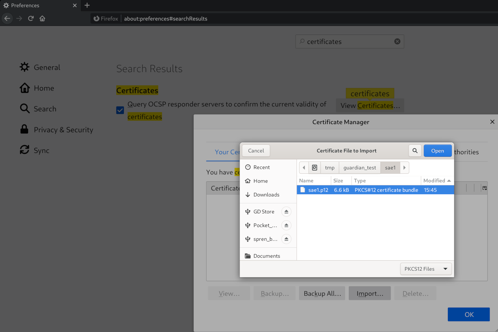
1. There should be no password on guardian-generated .p12 files, so click `OK` 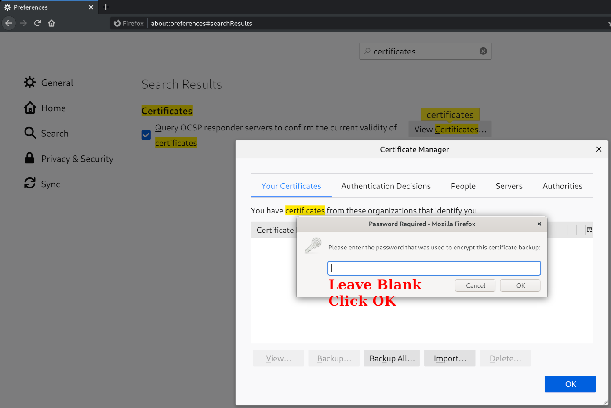
1. If the import was successful, the .p12 file should show up in your list of certificates. Check file permissions to ensure readability if you are having issues. 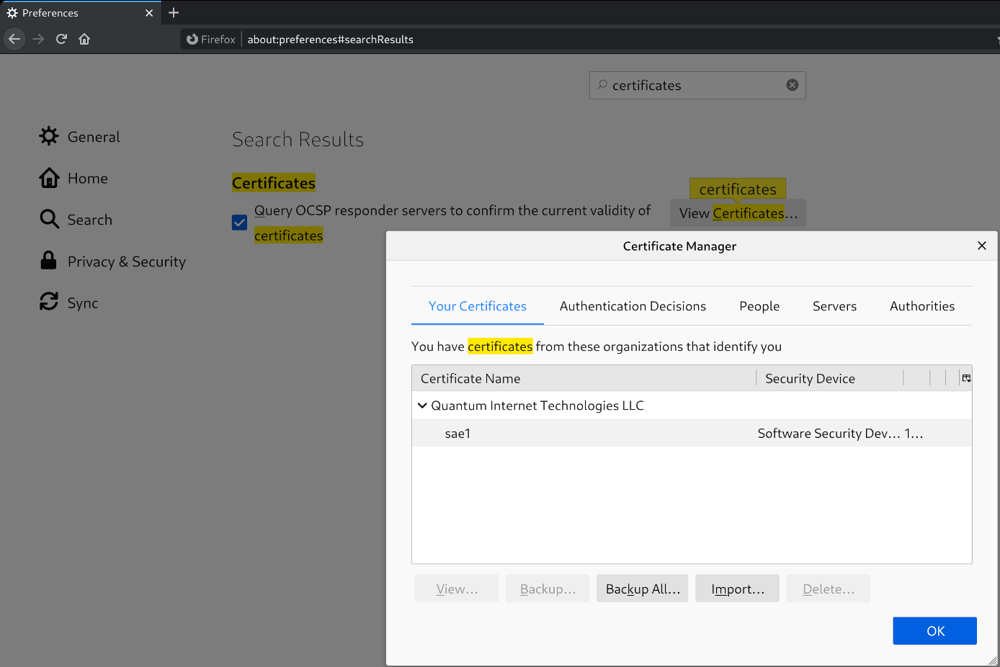
1. Navigate to the `Authorities` tab. Scroll down and verify the name of your Root Certificate Authority (Quantum Internet Technologies LLC, by default). 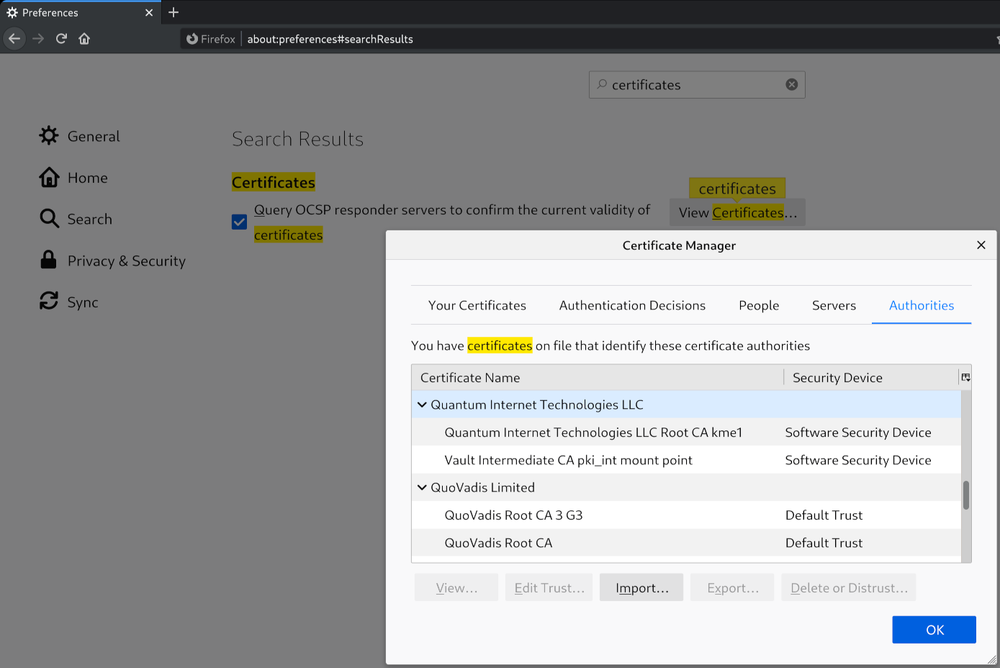
1. Additionally, you may opt to trust the Root CA for use in identifying websites 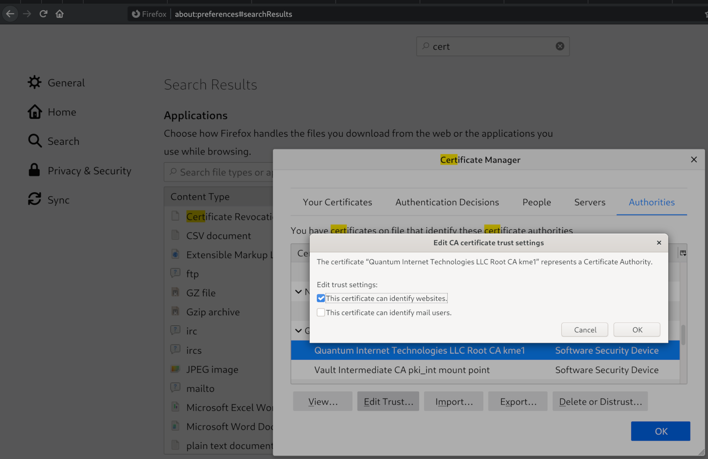
1. Click `OK` for the Certificate Manager and close the `Preferences` tab.
1. To remove certificates, follow the same procedure but use the `Delete or Distrust` button instead of `Import`. Be sure to remove not only the added certificate but also the Certificate Authorities as well. Also note the certificate may be cached. Tab hard refreshes (CONTROL+R/F5) and/or browser restarts can sometimes coax a certificate refresh.

#### Command-line Method

An equivalent method to the above UI Method involves using `certutil` and `pk12util`. On Fedora, the command `dnf whatprovides */certutil` shows it comes from the `nss-tools` RPM. On Ubuntu, `apt search certutil` shows it comes from `libnss3-tools`.

1. Find the Firefox Profile directory associated with your user account. Most often on a Linux system, it lives at `~/.mozilla/firefox/<random-string>.default/`. Usually, it is a `cert9.db` file under this directory that is housing the certificates. cert8.db files are older but possible. In essence, the file is an SQLite database.
1. Query the directory with the `certutil` to see what certificates are present:
    ```bash
    cproctor@spren:guardian_test>certutil -d ~/.mozilla/firefox/a6y6g3o7.default/ -L

    Certificate Nickname                                         Trust Attributes
                                                                 SSL,S/MIME,JAR/XPI

    DigiCert SHA2 Secure Server CA                               ,,
    ...
    kme1_sae1                                                    u,u,u
    kme1_CA                                                      ,,
    Quantum Internet Technologies LLC Root CA kme1 - Quantum Internet Technologies LLC ,,
    ```
1. To clear any residual certificates, use `-D` along with `-n`; see man pages for more:
    ```bash
    cproctor@spren:guardian_test>certutil -d ~/.mozilla/firefox/a6y6g3o7.default/ -D -n kme1_sae1
    cproctor@spren:guardian_test>certutil -d ~/.mozilla/firefox/a6y6g3o7.default/ -D -n kme1_CA
    cproctor@spren:guardian_test>certutil -d ~/.mozilla/firefox/a6y6g3o7.default/ -D -n "Quantum Internet Technologies LLC Root CA kme1 - Quantum Internet Technologies LLC"
    cproctor@spren:guardian_test>certutil -d ~/.mozilla/firefox/a6y6g3o7.default/ -L

    Certificate Nickname                                         Trust Attributes
                                                                 SSL,S/MIME,JAR/XPI

    DigiCert SHA2 Secure Server CA                               ,,
    ...
    ```
1. To add a new .p12 file, use the `pk12util` command along with the `-d`, `-i`, `-W` options:
    ```bash
    cproctor@spren:guardian_test>pk12util -d ~/.mozilla/firefox/a6y6g3o7.default/ -i /tmp/guardian_test/sae1/sae1.p12 -W ""
    pk12util: PKCS12 IMPORT SUCCESSFUL
    # Modify the trust attributes of the Root CA
    cproctor@spren:guardian_test>certutil -d ~/.mozilla/firefox/a6y6g3o7.default/ -M -t "CT,c," -n "Quantum Internet Technologies LLC Root CA kme1 - Quantum Internet Technologies LLC"
    cproctor@spren:guardian_test>certutil -d ~/.mozilla/firefox/a6y6g3o7.default/ -L

    Certificate Nickname                                         Trust Attributes
                                                                 SSL,S/MIME,JAR/XPI

    DigiCert SHA2 Secure Server CA                               ,,
    ...
    kme1_sae1                                                    u,u,u
    kme1_CA                                                      ,,
    Quantum Internet Technologies LLC Root CA kme1 - Quantum Internet Technologies LLC CT,c,
    ```
1. Note the modified ("-M") certutil trust agruments ("-t"); here are the relevant meanings:
    ```
      + c - Valid CA
      + T - Trusted CA to issue client certificates (implies c)
      + C - Trusted CA to issue server certificates (SSL only) (implies c)
      + u - Certificate can be used for authentication or signing
    ```

### Chromium Setup

NOTE: This is being tested in a `Chromium` browser (open-source version of Chrome). There may or may not be differences if Chrome is used.

#### UI Method

1. Open a new tab and navigate to `chrome://settings/certificates`
1. Navigate to the `Your Certificates` tab; click `Import` and navigate to the .p12 file you wish to import 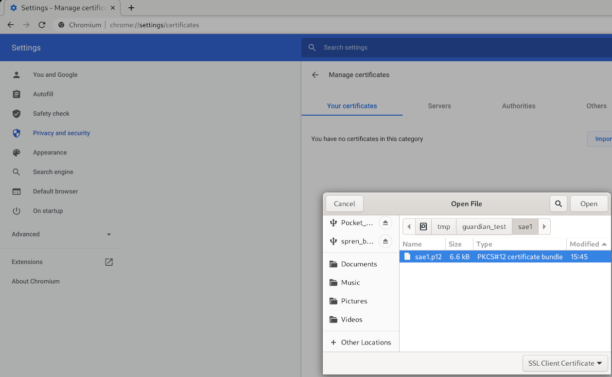
1. There should be no password on guardian-generated .p12 files, so click `OK` 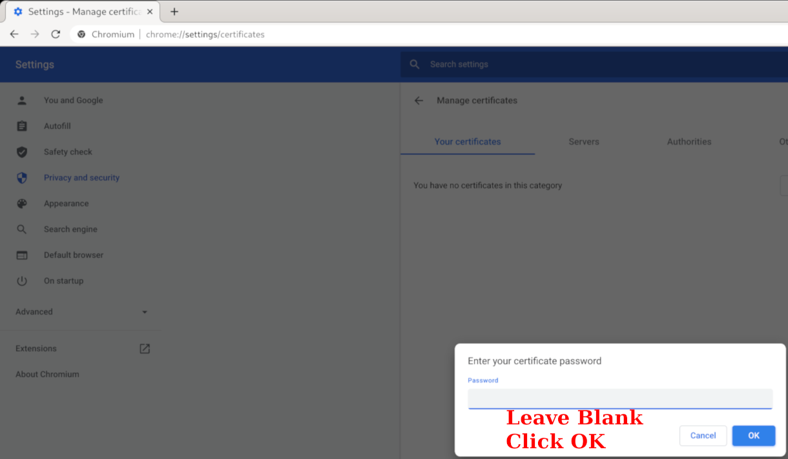
1. If the import was successful, the .p12 file should show up in your list of certificates. Check file permissions to ensure readability if you are having issues. 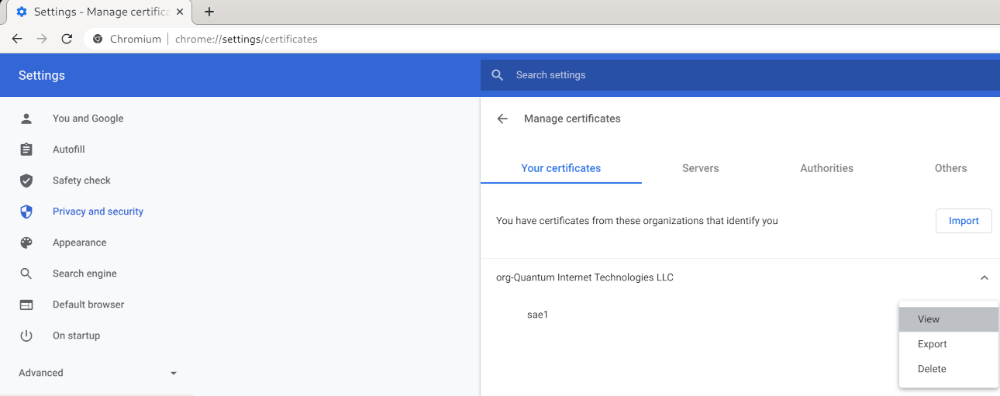
1. Navigate to the `Authorities` tab. Scroll down and verify the name of your Root Certificate Authority (Quantum Internet Technologies LLC, by default).
1. Additionally, you may opt to trust the Root CA for use in identifying websites 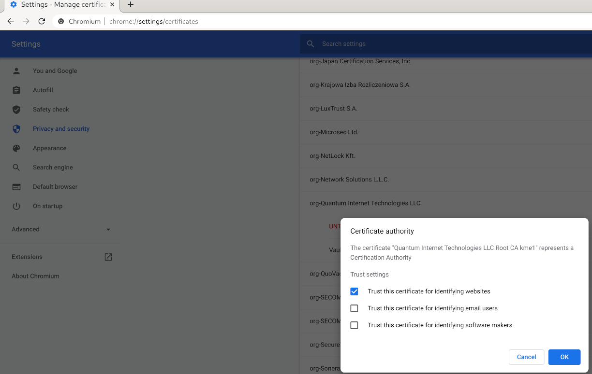
1. You may close the chrome settings tab when complete.
1. To remove certificates, follow the same procedure but use the `Delete` drop down option instead of `Import`. Be sure to remove not only the added certificate but also the Certificate Authorities as well. Also note the certificate may be cached. Tab hard refreshes (CONTROL+R/F5) and/or browser restarts can sometimes coax a certificate refresh.

#### Command-line Method

This section is identical to the Firefox command-line section except for the location of the Chrome profile. On Fedora, this is located at `~/.pki/nssdb`. Therefore, all commands will now look like:
```bash
cproctor@spren:~>certutil -d ~/.pki/nssdb/ -L

Certificate Nickname                                         Trust Attributes
                                                             SSL,S/MIME,JAR/XPI

kme1_sae1                                                    u,u,u
kme1_CA                                                      ,,
Quantum Internet Technologies LLC Root CA kme1 - Quantum Internet Technologies LLC CT,c,
```

where the `-d` directory option has been updated.

### Certificate Usage

Most public websites do not require a client-side certificate to be presented to the web server. In this particular case, because mutual TLS is being performed, we do need to choose the appropriate client-side certificate to use.

To do this, once you have properly installed via the Web UI or command-line method, you simply navigate to the desired website. The web server will prompt the client web browser for a certificate while also providing its own server-side certificate.

A window should pop up prompting you to choose the client-side certificate you wish to provide.

Firefox 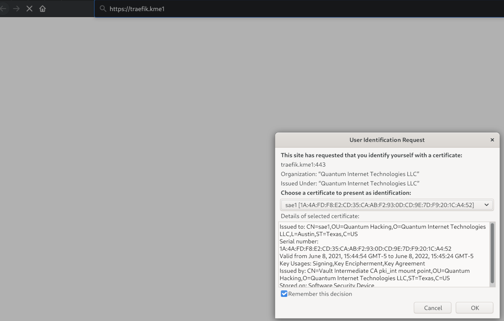

Chrome 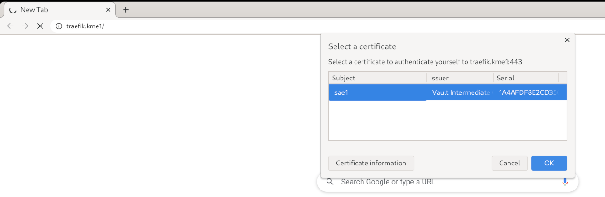

Choose (typically) either the `sae1` or `sae2` certificate depending on whether you are attempting to access a `kme1` or `kme2` webpage respectively.

NOTE: If the Root CA is not Trusted to identify websites, you will see a warning screen. It will alert you that the certificate issued by the web server is untrusted.

Firefox 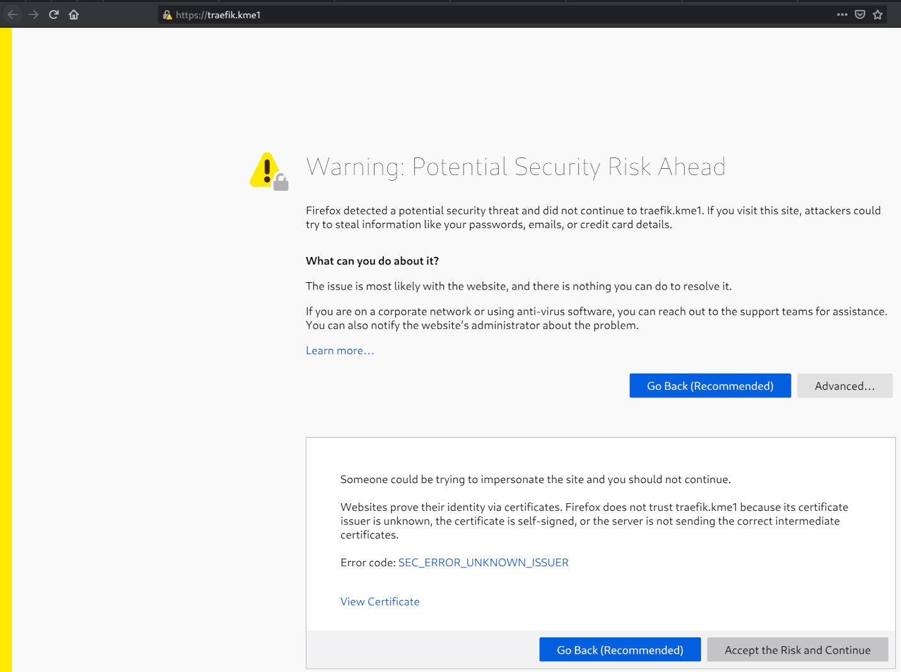

Chrome 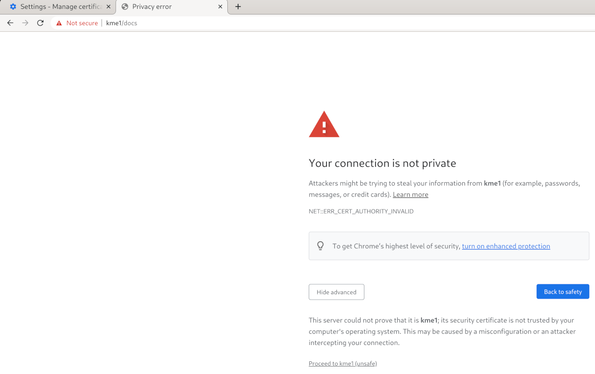

You may accept the risk and continue on to the site. You will have a small lock with a yellow/red caution triangle reminding you the connection is not secure/private. TLS is still being used but the browser does not trust the Root CA.

### Traefik Dashboard

With the appropriate client-side certificates installed and Root CAs trusted, you now navigate your web browser to:

https://traefik.kme1

https://traefik.kme2

The http:// version should redirect to the https:// version.

You will see on the main dashboard: 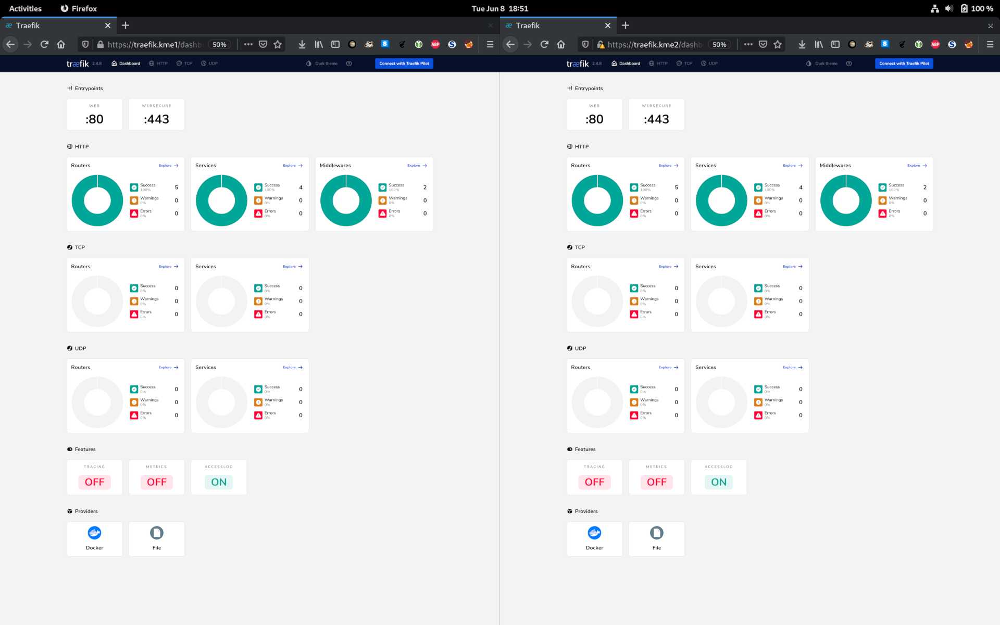
All HTTP Routers, Services, and Middlewares are successful and none have warnings or errors.

Entrypoints are configured for ports 80 (http redirecting to 443) and 443 (http with TLS -- https).

No TCP or UDP configurations are currently setup.

Both the `file` and `Docker`  providers are configured and listening.

You may explore other specific configuration options here.

NOTE: I don't view this page as particularly sensitive, but if you do, there are straightforward methods for putting an additional basic HTTP Authenication in front of this web page. Remember, you are already authenticating based on client-side certificates. But, you could configure some type of "admin" access as long as whomever does not have remote SSH access to the KME hosts.

NOTE: More specific details on how Traefik has been configured can be found in the [Traefik Configuration](Traefik.md) file.

### Vault UI

With the appropriate client-side certificates installed and Root CAs trusted, you now navigate your web browser to:

https://kme1:8200

https://kme2:8200

That's host `kme1` or `kme2` with port 8200.

The http:// version will not redirect to the https:// version. Instead, you will receive the message "Client sent an HTTP request to an HTTPS server."

NOTE: The Vault UI is running independent of the Traefik service. Vault is already configured with TLS support. It could be configured to be behind traefik with TLS certificate passthrough, if that is desired.

You will see the login page: 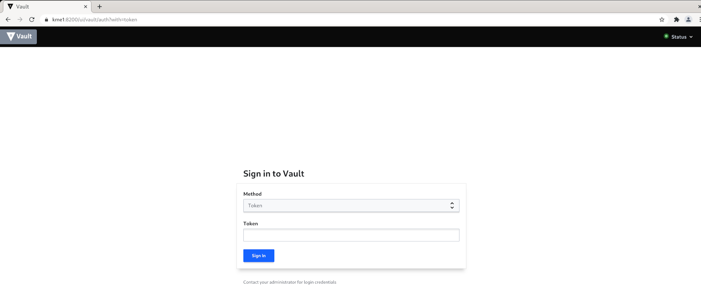

To login, you need to lookup a generated root token in the file `${TOP_DIR}/volumes/${LOCAL_KME_ID}/certificates/production/admin/vault/SECRETS`. Note that each KME host has its own independent Vault instance with its own root token.

The file will look something like:
```bash
alice@qtpi-1:~/code/guardian$ cat volumes/kme1/certificates/production/admin/vault/SECRETS
{
  "keys": [
    "5bc89f191f515c92af71704f06e639aa361a1ff2468ec19da756ae6bf4bf71aa64",
    "86f05b8749998b2335fcb14565ca8883a65dee1e3336739101f9dae3df04277e34",
    "a48b852fb73c258216ba79d104983182c643eb9eb6fa6fe0a38cd7cf3620c55eef",
    "2856641480d48143920d303a2b903351ff1e8122d39a777306f36a9f28689c85e2",
    "6427713e648a18f961719a02c32c64347394d64d9fd44f335a567e88db74352757"
  ],
  "root_token": "s.O8mUWreHhSi491IRsImuTUSe"
```

NOTE: the above keys and root_token will change any time the Vault instance is remade after a `make clean` or `makeallclean` is issued.

Copy the "root_token" value (the part starting with "s.O8...") and input this into the login page.

The Vault mainpage will look something like: 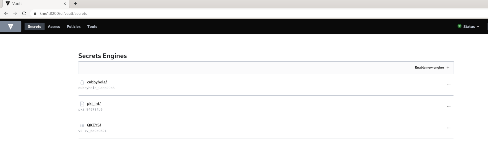

The `Secrets` Engines tab shows all enabled engines:
* cubbyhole - comes by default and is a local storage space (not used by this setup)
* pki_int - (Vault Type PKI Secrets Engine) Public Key Infrastructure (PKI) Intermediate (Int) is an intermediate Certificate Authority (CA) responsible for generating or signing new certificates
* QKEYS (Vault Type Key Value Version 2 Secrets Engine) is where the QKD key information is being stored and tracked

The `Access` tab shows allowed authentication methods, current entities, and current leases to those entities given a specific authentication method. Everything that is needed is already set up.

The `Policies` tab lists all the Access Control List (ACL) policies that are in the Vault instance. These policies dictate what can be done (or not done) by an entity that logs in with the particular role that uses a specific policy. Policies have been created for the Intermediate CA Certificate Issuer, the REST API, and the Watcher service.

The `tools` tab has various tools that one may find useful if spending a significant amount of time in Vault. Nothing of particular interest for us.

NOTE: More specific details on how Vault has been configured can be found in the [Vault Configuration](Vault.md) file.

### REST API Documentation OpenAPI

With the appropriate client-side certificates installed and Root CAs trusted, you now navigate your web browser to:

https://kme1/docs

https://kme2/docs

The http:// version should redirect to the https:// version.

You will see on the main documents page: 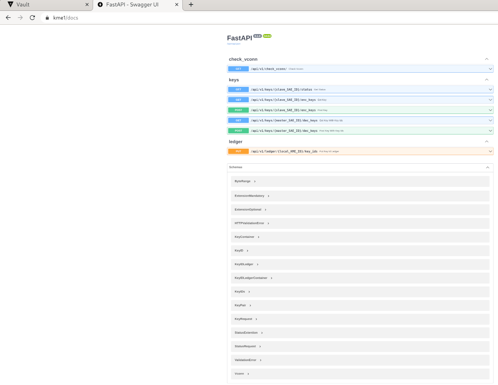

This is the primary developer documentation location that provides all relevant information for anyone implementing the SAE client to retrieve keying material. It includes the detailed implementation of all endpoints as well as built-in examples and the schema used in data requests and data responses.

NOTE: More specific details on how the REST API has been configured can be found in the [REST API Configuration](REST.md) file.

## Using cURL

See [key_compare.sh](../scripts/key_compare.sh) as an example of how one might test out receiving keys from both KME hosts via the 'make compare' target.

A representative request from a master SAE to a KME via the 'Get Key' GET method looks like:
```bash
curl "https://${LOCAL_KME_HOSTNAME}/api/v1/keys/${REMOTE_SAE_ID}/enc_keys?number=${N}&size=${S}" \
  -H "Content-Type: application/json" \
  -H "accept: application/json" \
  --key ${LOCAL_SAE_ID}/${LOCAL_SAE_ID}.key.pem \
  --cert ${LOCAL_SAE_ID}/${LOCAL_SAE_ID}.ca-chain.cert.pem \
  --cacert ${LOCAL_SAE_ID}/${LOCAL_SAE_ID}.ca-chain.cert.pem
```

where typical variable values might be:
```bash
LOCAL_KME_HOSTNAME=kme1
LOCAL_SAE_ID=sae1
REMOTE_SAE_ID=sae2
N=1
S=256
```

which requests one 256-bit key from KME Host 'kme1' as SAE 'sae1' setting remote (or slave) SAE as 'sae2'.

A representative KME host response would look like:
```bash
{
  "keys": [
    {
      "key_ID": "4273045b-95c3-5034-9ee9-e7732ae31471",
      "key": "vwkzuBm6fLEBZxIaDfRIZlGYXWcPy7EYzI5AiqKcFd4="
    }
  ]
}
```

where the `key_ID` is a UUID and the `key` material is Base64 encoded.

Next, a similar request from the remote SAE would take place to the other KME. This request from a slave SAE to the paired KME to the 'Get key with key IDs' GET method looks like:
```bash
curl "https://${REMOTE_KME_HOSTNAME}/api/v1/keys/${LOCAL_SAE_ID}/dec_keys&?key_ID=${KEY_ID}" \
  -H "Content-Type: application/json" \
  -H "accept: application/json" \
  --key ${REMOTE_SAE_ID}/${REMOTE_SAE_ID}.key.pem \
  --cert ${REMOTE_SAE_ID}/${REMOTE_SAE_ID}.ca-chain.cert.pem \
  --cacert ${REMOTE_SAE_ID}/${REMOTE_SAE_ID}.ca-chain.cert.pem
```

where corresponding variable values would be:
```bash
REMOTE_KME_HOSTNAME=kme2
LOCAL_SAE_ID=sae1
REMOTE_SAE_ID=sae2
KEY_ID=4273045b-95c3-5034-9ee9-e7732ae31471
```

The response from the other KME host would be identical to the response above.

NOTE: Inspect the FastAPI documents pages for in-depth examples that include autogenerated cURL payloads that can be used manually.

## Using OpenSSL and s_client

Detailed analysis of TLS connections can be carried out with the help of the `openssl s_client` tool.

Some representative queries would look like:
```bash
echo "quit" | openssl s_client \
  -cert ./sae1/sae1.ca-chain.cert.pem \
  -key ./sae1/sae1.key.pem \
  -CAfile ./sae1/sae1.ca-chain.cert.pem \
  -servername kme1 \
  -connect kme1:443
```

`-debug` and `-state` flags can be added for more verbose output.

`-tls1_2` or `-tls1_3` (among others) can be used to restrict the client-side TLS version request to the server.

Also the `-ciphersuites` and `-cipher` flags may be added to restrict the TLS handshake to specific ciphers, etc. You may use `openssl ciphers -v` to see which are available and what TLS version they are associated with. `-ciphersuites` is newer and (I believe) is associated with TLSv1.3 where `-ciphers` is older and is associated with TLSv1.2. Their relationship is deeper than this merits studying if you need to go to this level of analysis.

An example of a successful TLS handshake looks like:
```bash
echo "quit" | openssl s_client -cert ./sae1/sae1.ca-chain.cert.pem -key ./sae1/sae1.key.pem -CAfile ./sae1/sae1.ca-chain.cert.pem -servername kme1 -connect kme1:443
CONNECTED(00000003)
depth=2 C = US, ST = Texas, L = Austin, O = Quantum Internet Technologies LLC, OU = Quantum Hacking Division, CN = Quantum Internet Technologies LLC Root CA kme1, emailAddress = admin@example.com
verify return:1
depth=1 C = US, ST = Texas, O = Quantum Internet Technologies LLC, OU = Quantum Hacking, CN = Vault Intermediate CA pki_int mount point
verify return:1
depth=0 C = US, ST = Texas, L = Austin, O = Quantum Internet Technologies LLC, OU = Quantum Hacking, CN = rest
verify return:1
---
Certificate chain
 0 s:C = US, ST = Texas, L = Austin, O = Quantum Internet Technologies LLC, OU = Quantum Hacking, CN = rest
   i:C = US, ST = Texas, O = Quantum Internet Technologies LLC, OU = Quantum Hacking, CN = Vault Intermediate CA pki_int mount point
 1 s:C = US, ST = Texas, O = Quantum Internet Technologies LLC, OU = Quantum Hacking, CN = Vault Intermediate CA pki_int mount point
   i:C = US, ST = Texas, L = Austin, O = Quantum Internet Technologies LLC, OU = Quantum Hacking Division, CN = Quantum Internet Technologies LLC Root CA kme1, emailAddress = admin@example.com
 2 s:C = US, ST = Texas, L = Austin, O = Quantum Internet Technologies LLC, OU = Quantum Hacking Division, CN = Quantum Internet Technologies LLC Root CA kme1, emailAddress = admin@example.com
   i:C = US, ST = Texas, L = Austin, O = Quantum Internet Technologies LLC, OU = Quantum Hacking Division, CN = Quantum Internet Technologies LLC Root CA kme1, emailAddress = admin@example.com
---
Server certificate
-----BEGIN CERTIFICATE-----
MIIFxzCCA6+gAwIBAgIUeZBwVJG1ik3CmMDMaDXgb2X5n/swDQYJKoZIhvcNAQEL
...
Z4J+gZ1+ag8V/7707xrRpDOb6u9qZx15hW8GJUha299cjI24P/JSvbUrGg==
-----END CERTIFICATE-----
subject=C = US, ST = Texas, L = Austin, O = Quantum Internet Technologies LLC, OU = Quantum Hacking, CN = rest

issuer=C = US, ST = Texas, O = Quantum Internet Technologies LLC, OU = Quantum Hacking, CN = Vault Intermediate CA pki_int mount point

---
Acceptable client certificate CA names
C = US, ST = Texas, L = Austin, O = Quantum Internet Technologies LLC, OU = Quantum Hacking, CN = rest
C = US, ST = Texas, O = Quantum Internet Technologies LLC, OU = Quantum Hacking, CN = Vault Intermediate CA pki_int mount point
C = US, ST = Texas, L = Austin, O = Quantum Internet Technologies LLC, OU = Quantum Hacking Division, CN = Quantum Internet Technologies LLC Root CA kme1, emailAddress = admin@example.com
C = US, ST = Texas, L = Austin, O = Quantum Internet Technologies LLC, OU = Quantum Hacking, CN = rest
C = US, ST = Texas, O = Quantum Internet Technologies LLC, OU = Quantum Hacking, CN = Vault Intermediate CA pki_int mount point
C = US, ST = Texas, L = Austin, O = Quantum Internet Technologies LLC, OU = Quantum Hacking Division, CN = Quantum Internet Technologies LLC Root CA kme2, emailAddress = admin@example.com
C = US, ST = Texas, L = Austin, O = Quantum Internet Technologies LLC, OU = Quantum Hacking, CN = sae1
Requested Signature Algorithms: RSA-PSS+SHA256:ECDSA+SHA256:Ed25519:RSA-PSS+SHA384:RSA-PSS+SHA512:RSA+SHA256:RSA+SHA384:RSA+SHA512:ECDSA+SHA384:ECDSA+SHA512:RSA+SHA1:ECDSA+SHA1
Shared Requested Signature Algorithms: RSA-PSS+SHA256:ECDSA+SHA256:Ed25519:RSA-PSS+SHA384:RSA-PSS+SHA512:RSA+SHA256:RSA+SHA384:RSA+SHA512:ECDSA+SHA384:ECDSA+SHA512
Peer signing digest: SHA256
Peer signature type: RSA-PSS
Server Temp Key: X25519, 253 bits
---
SSL handshake has read 6594 bytes and written 5496 bytes
Verification: OK
---
New, TLSv1.3, Cipher is TLS_AES_128_GCM_SHA256
Server public key is 2048 bit
Secure Renegotiation IS NOT supported
Compression: NONE
Expansion: NONE
No ALPN negotiated
Early data was not sent
Verify return code: 0 (ok)
---
```

Another request example that uses TLSv1.2 with the ECDHE-RSA-AES128-GCM-SHA256 cipher using the Server Name Indication (SNI) of `kme1`:
```bash
echo "quit" | openssl s_client \
  -cert ./sae1/sae1.ca-chain.cert.pem \
  -key ./sae1/sae1.key.pem \
  -CAfile ./sae1/sae1.ca-chain.cert.pem \
  -servername kme1 \
  -tls1_2 \
  -connect kme1:443 \
  -ciphersuites "" \
  -cipher ECDHE-RSA-AES128-GCM-SHA256
```

With multiple ciphersuites:
```bash
echo "quit" | openssl s_client \
  -cert ./sae1/sae1.ca-chain.cert.pem \
  -key ./sae1/sae1.key.pem \
  -CAfile ./sae1/sae1.ca-chain.cert.pem \
  -servername kme1 \
  -tls1_2 \
  -connect kme1:443 \
  -ciphersuites TLS_ECDHE_ECDSA_WITH_AES_256_GCM_SHA384:TLS_ECDHE_ECDSA_WITH_AES_128_GCM_SHA256:TLS_ECDHE_ECDSA_WITH_AES_128_CBC_SHA256
```
