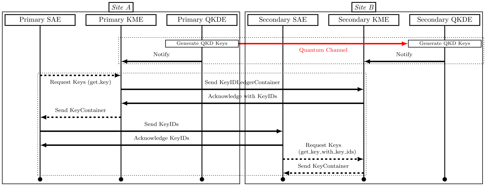

# Superceded by https://guardian.readthedocs.io/en/latest/

# Getting Started

| Document | Description |
| --- | --- |
| [Installation Prerequisites](Prerequisites.md) | Installation of dependencies and initial configuration options |
| [Initialization Procedures](Initialization.md) | Initial generation of certificates, Vault initialization, and keying material ingestion |
| [Running the REST API](Running.md) | Startup, logging, shutdown, keying material ingestion, clearing and cleaning |
| [Interacting with the REST API](Interacting.md) | Using a client-side certificate in a web browser, with cURL, or OpenSSL's s_client |

# Configuration Options

| Document | Description |
| --- | --- |
| [Logging Configuration](Logging.md) | Logging configuration details for each service |
| [Global Configuration](Global.md) | Global configuration details available to most services |
| [Vault](Vault.md) | Vault instance service detailed configuration information |
| [Vault Initialization Client](Vault_Init.md) | Vault intialization client service detailed configuration information |
| [QKD](QKD.md) | QKD simulator service detailed confgiuration information; transition to a full QKD system implementation |
| [Watcher](Watcher.md) | Watcher service detailed configuration information |
| [Unsealer](Unsealer.md) | Unsealer service detailed configuration information |
| [Traefik](Traefik.md) | Traefik service detailed configuration information |
| [REST API](REST.md) | REST API detailed configuration information |

# Overview

* ETSI GS QKD 014 v1.1.1 (2019-02) REST API Draft Standard [Document](https://www.etsi.org/deliver/etsi_gs/QKD/001_099/014/01.01.01_60/gs_qkd014v010101p.pdf)

* [Services Overview](Overview.md)

# Extra

* [Certificate Generation Overview](Certificates.md)
* [Hands-on Demonstration Instructions](Demo.md)
